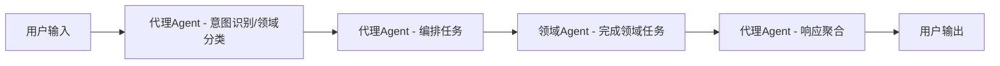

# CloudBrain — 多智能体平台

> 本文档描述了多智能体系统的整体架构、技术选型与项目结构，适用于本地和远程多端部署场景。

## 一、功能描述（从用户视角）

核心目标：提供一个可本地部署、可远程访问的多智能体系统，支持知识问答、任务自动化和数据分析。

- 支持用户自然语言输入，通过代理 Agent 自动识别意图与领域，编排对应领域智能体（Agent）处理，由代理 Agent 汇总输出。
- 多领域智能体协作，涵盖财务、医疗、IT、法律、创作等场景。
- 每个智能体可自主学习，持续更新自己的知识库（长期记忆）。
- 支持 PC 本地部署，手机 App 或浏览器远程访问。
- 实时交互、知识问答、任务自动化、数据分析等功能。
- 提供日志、监控、数据安全等基础能力。

典型使用场景：
- 智能问答：用户就某一领域（如股票、法律条款）提问，对应领域 Agent 结合自身 RAG 知识库给出回答。
- 任务协作：用户发出一个复合任务（如"分析这份财报并生成概要"），由多个 Agent（财务分析、语言润色等）协同完成。
- 持续学习：用户上传新文档或数据，相关 Agent 自动更新其 RAG 知识库，后续问答可利用新知识。

## 二、架构设计

流程图（简要）



### 用户输入层
- 负责接收用户文本输入，并做基础预处理。
- 前端侧完成大部分输入规范化，后端仅做必要的合法性检查。

### 意图识别与领域分类
- 由代理 Agent 调用大模型识别意图，编排领域任务，输出结构化标签（如 `intent` / `domains` / `confidence`），并为后续路由与编排提供依据。
  - 例如：帮我讲解下下面的题目：xxx?
    由代理 Agent 获取可用的领域 Agent 列表和模型配置，通过大模型识别出需要用到 `teacher-agent`，创建调用老师 Agent 来做题目讲解，把结果返回给代理 Agent，再由代理 Agent 格式化输出。
- 如果没有匹配的领域 Agent，由代理 Agent 直接完成，并向用户提示当前是由通用 Agent 回答。
- 实现位于 `backend/src/services/intent.service.ts`，内部委托 `proxy-agent` 进行意图识别。
- proxy-agent 的分类 System Prompt（`classifyPrompt`）和聚合 System Prompt（`aggregatePrompt`）均可在设置页面自定义配置，留空则使用内置默认 Prompt。

### 路由调度层
- 根据意图与领域标签选择一个或多个合适的 Agent，构建调用计划（单 Agent / 多 Agent 串行或并行）。
- 对应实现位于 `backend/src/services/router.service.ts`，只关心"调用哪个 Agent、以什么顺序"，不关心具体 Agent 内部实现细节。

### 领域智能体（Agent）
- 每个配置驱动的 Domain Agent 独立封装在 `backend/agents/<domain>-agent` 下（纯配置，不含代码），代码驱动的 Agent（如 proxy-agent）保留在 `backend/src/agents/` 下。
- 每个 Agent 有自己 RAG 数据库来存储自己的知识库（LanceDB，默认位于 Agent 目录下的 `lancedb/` 子目录）。
- 每个 Agent 可以配置自己的大模型（如不同云厂商/不同模型版本）和 Temperature。
- 每个 Agent 有自己的 **Skill 集合**（Markdown 提示词模板，遵循 OpenSkill 标准）和 **Tool 集合**（HTTP API 或脚本，JSON 配置驱动）。
- Skill 元数据预加载供路由决策，内容通过 `use_skill` 工具由 LLM 按需加载。
- Tools 通过 `tool-loader.ts` 自动发现，支持 HTTP 请求（带 `{{paramName}}` 模板占位符）和脚本执行（Node.js / Python / Bash）两种 handler 类型。
- 每个 Agent 可通过 `query_knowledge` 工具查询自己的 RAG 知识库（LanceDB 向量检索），LLM 在需要时自主调用。
- 各 Agent 内部通过 `runWithSkills()` 统一调用器实现 LLM + tool-calling 循环，同时支持 Skill 工具、RAG 知识检索工具和自定义 Tools。

### 响应聚合层
- 当多 Agent 协作完成任务时，需要统一代理 Agent 聚合响应（合并结果、去重、排序、摘要）。
- 对应实现位于 `backend/src/services/aggregation.service.ts`。

### 日志与监控
- 负责全链路日志记录、异常告警、性能指标采集。
- 日志写入封装在 `backend/src/infra/logger`，对上层暴露统一 Logger 接口。

### 安全与权限
- 负责基础安全能力，如本地访问控制、速率限制等。
- 主要通过 `backend/src/middlewares` 中的中间件实现。单用户场景下只需保护本机数据安全。

### 任务执行与恢复
- 后端作为长驻服务运行，负责管理所有 Agent 任务的生命周期，前端 UI 仅作为"遥控器"和"显示器"。
- 前端窗口关闭或设备锁屏时，不会中断后端正在执行的任务；任务状态完全由后端控制。
- WebSocket 实时推送任务状态、新消息、知识库导入进度等事件（`ws://host:port/ws`）。
- 后端在执行长任务时，会将任务状态、进度和中间结果持续写入 SQLite，以便在进程重启后可以自动恢复或重试。

## 三、技术选型

### 后端
- **Node.js + Express + TypeScript** 为主后端与智能体编排框架。
- **通信协议**：RESTful API + WebSocket（`ws` 库，实时消息推送与任务状态通知）。
- 部署方式：
  - 开发环境：`npx ts-node src/index.ts` 直接运行（端口 3000）。
  - 生产环境：Docker 容器化部署，通过 `docker-compose` 一键启动。
- 主要依赖：
  - Web 框架：`express`, `cors`, `helmet`
  - 数据库：`better-sqlite3`（同步、无需编译的 SQLite 绑定）
  - WebSocket：`ws`
  - 日志：`winston`
  - RAG / 向量库：`@lancedb/lancedb` v0.4.20+（原生 LanceDB 客户端）
  - 嵌入向量：`OpenAIEmbeddings`（来自 `@langchain/openai`，兼容所有 OpenAI-compatible 端点，自动检测嵌入模型）
  - LLM 抽象 & Agent 编排：`langchain`, `@langchain/core`, `@langchain/openai`
  - Tool schema 定义：`zod`（用于 `DynamicStructuredTool` 的参数 schema）
  - 文件上传：`multer`（用于 Tool 脚本上传）
  - 环境变量：`dotenv`
  - 开发工具：`typescript`, `ts-node`

#### 后端 package.json 脚本

```jsonc
{
  "scripts": {
    "dev": "npx ts-node src/index.ts",             // 开发环境直接运行
    "build": "tsc",                                 // TypeScript 编译
    "start": "node dist/index.js",                  // 生产环境运行
    "migrate": "npx ts-node src/infra/db/migrate.ts", // 执行数据库迁移
    "seed": "npx ts-node src/infra/db/seed.ts"      // 导入种子数据
  }
}
```

#### 环境变量（.env）

在 `backend/` 目录下使用 `.env` 文件加载环境变量（通过 `dotenv`）：

```env
# === 数据库 ===
SQLITE_DB_PATH=../database/cloudbrain.db

# === 服务 ===
PORT=3000
NODE_ENV=development
LOG_LEVEL=debug

# === Agent 发现目录（逗号分隔，相对于 backend/ 或绝对路径，留空则仅扫描内置 agents/） ===
# AGENT_DIRS=../custom-agents,/opt/extra-agents
```

### 前端（Web）
- **React 19 + TypeScript + Vite 7** 单页应用，CSS Modules 实现样式隔离。
- 开发端口 5173，通过 Vite proxy 或直连后端 :3000 调用 API。
- 路由：`react-router-dom` v7，路径包括 `/chat`、`/chat/:conversationId`、`/agents`、`/settings`。
- 实时通信：通过 WebSocket 客户端（`ws.ts`）连接后端 `/ws`，接收消息推送与任务通知。
- 主要依赖：
  - UI 框架：`react` v19, `react-dom`
  - 路由：`react-router-dom` v7
  - 构建：`vite` v7, `@vitejs/plugin-react`
  - 类型：`typescript`

#### 前端 UI 功能模块

前端按"功能域"拆分为 4 个核心页面：

- **会话主页（ChatPage）**：
  - 左侧 Sidebar：对话列表，支持新建、重命名、删除对话。
  - 中间：消息区域（MessageBubble 组件），按时间顺序展示 user / assistant 的对话气泡，支持 Markdown 渲染。
  - 底部：ChatInput 组件，多行输入、回车发送。
  - 首条消息发送后自动调用 LLM 生成对话标题。
- **Agent 管理（AgentsPage）**：
  - 列表卡片展示所有已注册的 Agent（含 proxy-agent 和各 Domain Agent）。
  - 支持开启/关闭 Agent、查看描述与技能标签。
  - 支持通过 UI 直接创建新 Agent（POST `/api/agents`）和删除 Agent。
  - 点击 Agent 弹出 **AgentConfigModal**（Tab 页式弹窗），包含 5 个 Tab：
    - **基本配置**：ID、名称、描述、标签、Temperature、模型选择
    - **Prompt**：System Prompt 编辑（textarea，rows=12）
    - **Skills**：Skill CRUD（ID、名称、描述、Markdown 内容）
    - **Tools**：Tool CRUD（参数定义、HTTP/Script handler、脚本上传）
    - **知识库**：文档导入（文件上传/文本粘贴）、文档列表与删除
  - 弹窗固定 780px 宽、80vh 高，Tab 面板独立滚动，底部按钮栏固定。
- **设置（SettingsPage）**：
  - **模型管理**：添加/编辑/删除 LLM 模型配置（名称、model、API Key、Base URL），支持设为默认模型和连通性测试。
  - **Proxy Agent 配置**（Tab 页布局，5 个 Tab）：
    - **基本配置**：模型选择（可使用默认模型或指定模型）、Temperature 滑块（0-1）
    - **Prompt**：代理路由 System Prompt（用于意图识别，支持 `{agentList}` 占位符）、内容聚合 System Prompt（用于汇总多 Agent 输出），留空则使用内置默认
    - **Skills**：Proxy Agent 的 Skill CRUD
    - **Tools**：Proxy Agent 的 Tool CRUD（HTTP API / 脚本执行）
    - **知识库**：Proxy Agent 的知识库文档管理
  - 页面滚动条在最右侧，内容区域限宽 700px。

### 前端（App）
- **Flutter 3.x**（桌面端、H5、iOS、Android），统一一套代码多端构建，Material 3 主题。
- 状态管理：**Provider + ChangeNotifier**（MVVM），`features/*/viewmodels` 中集中管理。
- 路由：**go_router** v14，`StatefulShellRoute.indexedStack` 实现底部导航 + 独立全屏页面。
- 实时通信：**web_socket_channel** 封装 `WsService`（单例、自动重连、事件监听），连接后端 `/ws`。
- 生命周期管理：`AppLifecycleManager`（`WidgetsBindingObserver`）统一协调前后台切换 → WebSocket 断连/重连、状态持久化（`SharedPreferences`）、数据自动刷新。
- ViewModel 实现 `LifecycleAware` mixin，支持 `saveState()` / `restoreState()` / `onResumed()`，App 恢复时自动刷新数据、恢复到之前的对话。
- 导航状态恢复：`MaterialApp.router` 和 `GoRouter` 均配置 `restorationScopeId`，系统销毁后可恢复路由栈。
- 主要依赖：
  - UI 框架：`flutter` SDK ≥ 3.0, Material 3
  - 状态管理：`provider` ^6.1
  - 路由：`go_router` ^14.0
  - HTTP：`http` ^1.2
  - WebSocket：`web_socket_channel` ^3.0
  - Markdown 渲染：`flutter_markdown` ^0.7
  - 本地存储：`shared_preferences` ^2.3
  - 国际化：`intl` ^0.19

#### App UI 功能模块

App 端功能与 Web 端完全对齐，底部导航栏 3 个 Tab + 全屏子页面：

- **对话页（ChatPage）**：
  - 响应式布局：宽屏（≥600px）左右分栏（对话列表 + 消息区），窄屏单面板切换。
  - 对话列表：支持新建、删除、重命名，显示最后更新时间。
  - 消息区域：Markdown 渲染气泡，自动滚动到底部，空状态品牌展示。
  - 发送消息自动创建对话（无需预先新建），首条消息后自动调用 LLM 生成标题。
  - WebSocket + 轮询双通道（race 模式）实时获取任务结果。

- **Agent 管理（AgentsPage）**：
  - 卡片列表展示所有 Agent，含标签、模型、来源（配置驱动/代码驱动）标识。
  - 支持创建新 Agent（表单弹窗：ID、名称、描述、标签、温度）和删除 Agent。
  - Refresh 按钮触发后端重新发现。
  - 点击 Agent 跳转 **AgentConfigPage**（全屏，5 Tab TabBar）：
    - **基本配置**：名称、描述、标签、模型选择（Dropdown）、Temperature（Slider）、启用开关
    - **Prompt**：System Prompt 编辑器
    - **Skills**：Skill 列表 + BottomSheet 编辑器（ID/名称/描述/内容）
    - **Tools**：Tool 列表 + 启用开关 + BottomSheet 编辑器（HTTP method/URL/参数）
    - **知识库**：文档列表、导入（标题+内容）、删除、清空

- **设置（SettingsPage）**：
  - **模型管理**：卡片展示所有模型配置，支持添加/编辑/删除/设为默认/连通性测试。
  - **Proxy Agent 配置**（5 Tab TabBar）：
    - **基本配置**：模型选择、Temperature
    - **Prompt**：分类 Prompt + 聚合 Prompt
    - **Skills**：Proxy Agent Skill CRUD
    - **Tools**：Proxy Agent Tool CRUD
    - **知识库**：Proxy Agent 文档管理
  - 关于信息。

- **Onboarding**：首次使用引导（全屏页面）。

#### 典型交互流程

- 新建对话 → 底部导航"对话" Tab / Sidebar 点击"新建" → 创建 conversation → 输入消息通过 WebSocket 调用 proxy-agent → 首条消息后自动生成标题
- 管理 Agent → AgentsPage 卡片列表 → 点击 Agent 进入 AgentConfigPage（App 全屏 5-Tab）/ AgentConfigModal（Web 弹窗 5-Tab）→ 按 Tab 编辑基本信息/Prompt/Skills/Tools/知识库
- 导入知识 → Agent 配置页面或 Settings 页面的"知识库"Tab → 文件上传或文本粘贴 → 后端向量化入库
- 后台恢复 → App 进入后台自动保存当前对话 ID 到 SharedPreferences → 返回前台后恢复选中对话并刷新数据 → WebSocket 自动重连

### 数据存储
- SQLite（本地）记录对话、任务、系统配置等结构化数据，默认单用户场景。

### 长期记忆与知识增强
- LanceDB（本地）作为向量数据库，用于存储文本、文档的 Embedding 向量，实现 RAG 能力。
- 每个 Agent 维护自己的向量库，默认目录为 Agent 目录下的 `lancedb/` 子目录。若 Agent 未提供 `dataDir`，回退到集中目录 `database/lancedb/<agent-id>`。
- RAG 流程由 `rag-service.ts` 统一管理（文档切片 → OpenAI Embeddings 向量化 → LanceDB 写入/检索），通过 `rag-tool.ts` 封装为 `query_knowledge` LangChain 工具。
- 嵌入模型自动检测：根据 API 端点自动选择嵌入模型（OpenAI 用 `text-embedding-3-small`，其他兼容端点自动探测可用模型）。

### 数据建模（SQLite）

采用简单、易扩展的表结构，场景默认单用户：

```typescript
/** conversations 表 — 对话/任务线程 */
interface ConversationRecord {
  id: string;                  // UUID
  title: string;               // 对话标题（可自动生成或用户编辑）
  status: 'active' | 'archived' | 'closed';
  created_at: string;          // ISO 8601
  updated_at: string;
}

/** messages 表 — 对话消息 */
interface MessageRecord {
  id: string;                  // UUID
  conversation_id: string;     // FK → conversations.id
  role: 'user' | 'assistant' | 'system' | 'agent';
  content: string;
  agent_id?: string;           // 当 role='agent' 时标识来源 Agent
  created_at: string;
}

/** agent_logs 表 — Agent 调用日志 */
interface AgentLogRecord {
  id: string;
  conversation_id: string;
  agent_id: string;
  input: string;               // JSON 字符串
  output: string;              // JSON 字符串
  latency_ms: number;
  success_flag: boolean;
  created_at: string;
}

/** tasks 表 — 长任务追踪与恢复 */
interface TaskRecord {
  id: string;
  conversation_id?: string;
  type: 'agent_invoke' | 'ingest' | 'maintenance';
  status: 'pending' | 'running' | 'succeeded' | 'failed' | 'canceled';
  payload: string;             // JSON 字符串
  result?: string;             // JSON 字符串
  progress?: number;           // 0-100
  error?: string;
  created_at: string;
  updated_at: string;
  last_heartbeat_at?: string;
}

/** configs 表 — 系统与 Agent 配置 */
interface ConfigRecord {
  key: string;                 // 如 "agent_model_mapping"、"api_keys"
  value: string;               // JSON 字符串
  scope: 'system' | 'agent';
  updated_at: string;
}
```

**模型与 Agent 的集中绑定关系以数据库为唯一真源。**

### AI 能力
- 统一通过 `backend/src/integrations` 封装大模型调用：
  - `openai.client.ts` — 所有模型均通过 OpenAI 兼容 API 调用
  - `llm.factory.ts` — LLM 工厂，根据配置创建 ChatModel 实例
- 用户只需在设置页面配置 API Key、API URL 和模型名称，即可对接 OpenAI 及所有兼容 OpenAI API 的大模型服务。
- LangChain 作为统一的 LLM 抽象层，业务代码优先依赖 LangChain 的 LLM/ChatModel 接口。

#### 模型与 Agent 配置

模型配置集中存放在 SQLite `configs` 表中，以数据库为唯一真源：

- `key = "api_keys"`：存储所有已配置的模型列表（数组），每个模型包含 id、name、model、apiKey、baseUrl、testResult 等字段，支持设置默认模型和连通性测试。
- `key = "agent_model_mapping"`：存储 Agent 与模型的绑定关系以及 Agent 级别配置。

`agent_model_mapping` 配置结构：
```json
{
  "defaultModel": "model-uuid-1",
  "agents": {
    "proxy-agent": {
      "enabled": true,
      "model": "model-uuid-1",
      "temperature": 0.7,
      "classifyPrompt": "",
      "aggregatePrompt": ""
    },
    "stock-agent": {
      "enabled": true,
      "model": "model-uuid-2",
      "temperature": 0.3,
      "systemPrompt": "你是一个专业的金融分析助手…"
    }
  }
}
```

`api_keys` 配置结构：
```json
[
  {
    "id": "model-uuid-1",
    "name": "GPT-4.1 Mini",
    "model": "gpt-4.1-mini",
    "apiKey": "sk-...",
    "baseUrl": "https://api.openai.com/v1",
    "isDefault": true,
    "testResult": { "success": true, "latency": 520, "testedAt": "..." }
  }
]
```

## 四、项目结构

```text
cloudbrain/
├── backend/                           # Node.js 主后端服务（Express + TypeScript）
│   ├── src/
│   │   ├── index.ts                  # 服务器启动入口（HTTP + WebSocket）
│   │   ├── app.ts                    # Express 应用（挂载中间件、路由）
│   │   ├── config/                   # 配置（环境变量、Agent 种子配置）
│   │   │   ├── index.ts
│   │   │   └── agents.config.ts      # Agent 默认映射种子数据
│   │   ├── routes/                   # HTTP 路由层
│   │   │   ├── index.ts              # 路由聚合（挂载所有子路由到 /api）
│   │   │   ├── intent.routes.ts      # 意图识别 & 领域分类
│   │   │   ├── agent.routes.ts       # 调用 Agent 的统一入口
│   │   │   ├── chat.routes.ts        # 对话管理 CRUD
│   │   │   ├── knowledge.routes.ts   # 知识库导入/管理
│   │   │   └── admin.routes.ts       # 系统配置、任务管理、模型测试
│   │   ├── controllers/              # 控制器层
│   │   │   ├── intent.controller.ts
│   │   │   ├── agent.controller.ts   # Agent 列表/刷新/配置/Skill/Tool CRUD
│   │   │   ├── chat.controller.ts    # 含对话标题自动生成
│   │   │   ├── knowledge.controller.ts
│   │   │   └── health.controller.ts
│   │   ├── services/                 # 业务服务层
│   │   │   ├── intent.service.ts     # 委托 proxy-agent 做意图识别
│   │   │   ├── router.service.ts     # 路由调度
│   │   │   ├── aggregation.service.ts # 聚合多 Agent 响应
│   │   │   ├── chat.service.ts       # 对话/消息 CRUD
│   │   │   ├── task.service.ts       # 任务生命周期
│   │   │   └── ws.service.ts         # WebSocket 服务（广播事件到前端）
│   │   ├── agents/                   # Agent 共享代码 & 代码驱动的 Agent
│   │   │   ├── agent-discovery.ts    # Agent 自动发现与注册
│   │   │   ├── base-agent.ts         # 公共基础设施（模型配置、ChatModel、RAG、短期记忆）
│   │   │   ├── domain-agent.ts       # Domain Agent 工厂（createDomainAgent）
│   │   │   ├── skill-loader.ts       # Skill 加载器（扫描 skills/*.md）
│   │   │   ├── skill-tool.ts         # Skill → LangChain 工具（use_skill）
│   │   │   ├── skill-runner.ts       # 统一调用器（tool-calling 循环）
│   │   │   ├── rag-service.ts        # RAG 核心（文档切片/嵌入/LanceDB 检索）
│   │   │   ├── rag-tool.ts           # RAG → LangChain 工具（query_knowledge）
│   │   │   ├── tool-loader.ts        # Tool 加载器（JSON 配置 → DynamicStructuredTool）
│   │   │   └── proxy-agent/          # 代理 Agent（中枢编排）
│   │   │       ├── index.ts          # 意图识别 + 路由编排 + 聚合
│   │   │       ├── prompts/          # 内置 Prompt 模板（classify / aggregate）
│   │   │       │   └── classify.prompt.ts
│   │   │       ├── skills/           # proxy-agent 的 Skill
│   │   │       └── lancedb/          # proxy-agent 的知识库数据
│   │   ├── models/                   # SQLite 表操作封装
│   │   │   ├── conversation.model.ts
│   │   │   ├── message.model.ts
│   │   │   ├── agent-log.model.ts
│   │   │   ├── task.model.ts
│   │   │   └── config.model.ts
│   │   ├── middlewares/              # 中间件（日志、错误处理、限流）
│   │   ├── integrations/             # LLM 集成
│   │   │   ├── openai.client.ts      # OpenAI 兼容 API 客户端
│   │   │   └── llm.factory.ts        # ChatModel 工厂
│   │   ├── infra/                    # 基础设施封装
│   │   │   ├── db/                   # SQLite & LanceDB
│   │   │   │   ├── sqlite.client.ts
│   │   │   │   ├── lancedb.client.ts
│   │   │   │   ├── migrate.ts
│   │   │   │   └── seed.ts
│   │   │   └── logger/
│   │   │       └── logger.ts         # Winston 日志
│   │   ├── types/                    # TypeScript 类型定义
│   │   │   ├── agent.types.ts        # DomainAgent / AgentInput / AgentOutput
│   │   │   ├── api.types.ts          # API 请求/响应类型
│   │   │   ├── db.types.ts           # 数据库实体类型
│   │   │   └── skill.types.ts        # Skill 类型
│   │   └── utils/
│   ├── .env                          # 环境变量（不提交）
│   ├── tsconfig.json
│   └── package.json
├── web/                              # React 前端（SPA）
│   ├── src/
│   │   ├── main.tsx                  # 入口
│   │   ├── App.tsx                   # 路由配置
│   │   ├── pages/                    # 页面组件
│   │   │   ├── ChatPage.tsx          # 会话主页
│   │   │   ├── ChatPage.module.css
│   │   │   ├── AgentsPage.tsx        # Agent 管理
│   │   │   ├── AgentsPage.module.css
│   │   │   ├── SettingsPage.tsx      # 设置（模型 + Proxy Agent 配置）
│   │   │   ├── SettingsPage.module.css
│   │   │   ├── KnowledgePage.tsx     # 知识库管理（预留）
│   │   │   └── KnowledgePage.module.css
│   │   ├── components/               # 通用组件
│   │   │   ├── Layout.tsx            # 页面布局（Sidebar + main）
│   │   │   ├── Layout.module.css
│   │   │   ├── Sidebar.tsx           # 侧边栏（对话列表 + 导航）
│   │   │   ├── Sidebar.module.css
│   │   │   ├── ChatInput.tsx         # 消息输入框
│   │   │   ├── ChatInput.module.css
│   │   │   ├── MessageBubble.tsx     # 消息气泡（Markdown 渲染）
│   │   │   ├── MessageBubble.module.css
│   │   │   ├── AgentConfigModal.tsx  # Agent 配置弹窗（5-Tab）
│   │   │   └── AgentConfigModal.module.css
│   │   ├── services/                 # API 封装
│   │   │   ├── api.ts                # REST API 调用
│   │   │   └── ws.ts                 # WebSocket 客户端
│   │   └── styles/
│   │       └── global.css            # 全局样式 & CSS 变量
│   ├── index.html
│   ├── vite.config.ts
│   ├── tsconfig.json
│   └── package.json
├── frontend/                         # Flutter 前端（桌面/Web/移动端）
│   ├── lib/
│   │   ├── main.dart                 # 入口（生命周期管理初始化、Provider 注册）
│   │   ├── core/
│   │   │   ├── config/
│   │   │   │   └── app_config.dart    # 全局配置（API 地址、超时、轮询间隔）
│   │   │   ├── theme/
│   │   │   │   └── app_theme.dart     # Material 3 主题（亮色/暗色）
│   │   │   ├── router/
│   │   │   │   └── app_router.dart    # GoRouter（StatefulShellRoute 底部导航 + 全屏路由）
│   │   │   ├── widgets/
│   │   │   │   └── app_shell.dart     # 底部导航栏 Shell（对话/Agents/设置）
│   │   │   └── lifecycle/
│   │   │       └── app_lifecycle_manager.dart  # 生命周期管理器 + LifecycleAware mixin
│   │   ├── features/
│   │   │   ├── chat/
│   │   │   │   ├── pages/chat_page.dart           # 对话主页（响应式分栏）
│   │   │   │   ├── viewmodels/chat_viewmodel.dart  # 对话状态（WS + 轮询、自动建对话/标题）
│   │   │   │   └── widgets/
│   │   │   │       ├── chat_input.dart             # 消息输入框
│   │   │   │       ├── conversation_list.dart      # 对话列表
│   │   │   │       └── message_bubble.dart         # 消息气泡（Markdown）
│   │   │   ├── agents/
│   │   │   │   ├── pages/agents_page.dart          # Agent 列表（卡片 + 创建/删除）
│   │   │   │   ├── pages/agent_config_page.dart    # Agent 配置（5 Tab 全屏页面）
│   │   │   │   └── viewmodels/agents_viewmodel.dart
│   │   │   ├── settings/
│   │   │   │   ├── pages/settings_page.dart        # 设置页（模型管理 + Proxy 5-Tab）
│   │   │   │   └── viewmodels/settings_viewmodel.dart
│   │   │   └── onboarding/
│   │   │       └── pages/onboarding_page.dart      # 首次使用引导
│   │   ├── services/
│   │   │   ├── api_client.dart        # HTTP 基础封装
│   │   │   ├── chat_service.dart      # 对话/消息 API（含标题生成）
│   │   │   ├── agent_service.dart     # Agent/Skill/Tool/KB/Config/Model API
│   │   │   └── ws_service.dart        # WebSocket 客户端（单例、自动重连、生命周期感知）
│   │   ├── models/
│   │   │   ├── agent.dart             # Agent/Skill/ToolParam/AgentTool/DocumentSummary/ModelProvider
│   │   │   ├── conversation.dart
│   │   │   ├── message.dart
│   │   │   └── task.dart
│   │   └── utils/
│   │       └── format_utils.dart      # 时间格式化等工具函数
│   ├── assets/                       # 资源文件（图片、图标）
│   └── pubspec.yaml
├── docs/                             # 项目文档
├── deploy/                           # Docker、CI/CD 配置
├── database/                         # 数据库文件
│   └── cloudbrain.db                 # SQLite 数据库
└── README.md
```

## 五、模块职责说明

### 后端

- **backend/src/config**：通过 `dotenv` 加载 `.env` 环境变量，提供从 SQLite `configs` 表读取 Agent/模型配置的封装。以数据库为唯一真源；`agents.config.ts` 仅作为首次初始化的种子数据。
- **backend/src/routes + controllers**：HTTP 接口定义与入参/出参校验。`routes/index.ts` 统一挂载所有子路由到 `/api` 前缀下，包括 Agent CRUD、Skill CRUD、Tool CRUD（含脚本上传）、对话管理、知识库管理、系统配置与任务管理。
- **backend/src/services**：承载主要业务逻辑——`intent.service`（意图识别）、`router.service`（路由调度）、`aggregation.service`（响应聚合）、`chat.service`（对话/消息 CRUD）、`task.service`（任务生命周期）、`ws.service`（WebSocket 事件广播）。
- **backend/src/agents**：Agent 共享代码和代码驱动的 Agent。
  - `base-agent.ts`：所有 Agent 共享的底层基础设施（模型配置解析、ChatModel 创建、RAG 工具构建、短期记忆、统一 LLM 调用流程）。
  - `domain-agent.ts`：`createDomainAgent` 工厂 + `loadAgentConfig` 配置加载器。
  - `skill-loader.ts` / `skill-tool.ts` / `skill-runner.ts`：Skill 加载、包装为 LangChain 工具、统一调用器。
  - `rag-service.ts` / `rag-tool.ts`：RAG 文档切片/嵌入/检索，包装为 `query_knowledge` 工具。
  - `tool-loader.ts`：Tool 自动发现（扫描 `tools/*.json`），创建 `DynamicStructuredTool`，支持 HTTP 和脚本两种 handler。
  - `agent-discovery.ts`：启动时自动扫描 `backend/agents/` 目录及 `AGENT_DIRS` 配置的目录，优先检查 `agent.json`（配置驱动），否则回退到 `index.ts`（代码驱动），自动注入 `dataDir` 和 `loadedSkills` 并注册到 proxy-agent。
  - `proxy-agent/`：中枢代理 Agent，从 `agent_model_mapping` 读取可配置的 `classifyPrompt`、`aggregatePrompt`、`temperature`。
- **backend/src/models**：TypeScript 类型定义与 SQLite 表操作封装，每个文件导出 CRUD 函数。
- **backend/src/infra**：对 SQLite、LanceDB、Winston 日志等基础设施的封装。
- **backend/src/middlewares**：日志、错误处理、速率限制等横切关注点。
- **backend/src/integrations**：封装 LLM 调用（统一使用 OpenAI 兼容 API）。

### 前端

- **web/src/pages**：按功能拆分 4 个页面（ChatPage / AgentsPage / SettingsPage / KnowledgePage），每个页面有独立的 CSS Module。
- **web/src/components**：通用 UI 组件，包括 Layout（Sidebar + main 两栏布局）、Sidebar（对话列表导航）、ChatInput（输入框）、MessageBubble（消息气泡）、AgentConfigModal（Agent 配置弹窗）。
- **web/src/services**：`api.ts` 封装所有 REST API 调用，`ws.ts` 封装 WebSocket 连接与事件分发。
- **web/src/styles**：`global.css` 定义 CSS 变量和全局样式。

### Flutter App（frontend/）

- **`main.dart`**：`WidgetsFlutterBinding.ensureInitialized()` → 初始化 `AppLifecycleManager`（注册 `WidgetsBindingObserver`、连接 WebSocket、恢复持久化状态）→ 创建 ViewModel 实例并注册到生命周期管理器 → `MultiProvider` 注入 → `MaterialApp.router`。
- **`core/lifecycle/app_lifecycle_manager.dart`**：核心生命周期管理器。
  - `WidgetsBindingObserver` 监听 `resumed` / `paused` / `hidden` / `detached`。
  - `resumed`：自动重连 WebSocket，通知所有 `LifecycleAware` ViewModel 刷新数据。
  - `paused` / `detached`：将 ViewModel 状态序列化到 `SharedPreferences`，断开 WebSocket。
  - `LifecycleAware` mixin：`stateKey` 标识、`saveState()` 保存、`restoreState()` 恢复、`onResumed()` 刷新。
- **`core/router/app_router.dart`**：`GoRouter` + `StatefulShellRoute.indexedStack`，3 个分支（/chat、/agents、/settings），全屏路由（/agents/:id/config、/onboarding），配有 `restorationScopeId`。
- **`core/widgets/app_shell.dart`**：`NavigationBar` 底部导航栏（对话 / Agents / 设置）。
- **`services/ws_service.dart`**：WebSocket 单例客户端。自动重连（3 秒间隔），`onEvent()` / `onEventType()` 监听器（返回取消函数），`disconnect()` / `reconnect()` 支持后台断连前台恢复。
- **`services/agent_service.dart`**：完整 REST API 封装——Agent CRUD、Skill CRUD、Tool CRUD、知识库管理（文档列表/导入/删除/清空）、系统配置读写、模型连通性测试。
- **`services/chat_service.dart`**：对话 CRUD、消息 CRUD、发送消息、任务状态查询、标题自动生成。
- **`models/agent.dart`**：Agent（含 labels、source、systemPrompt、model、defaultTemperature）、Skill、ToolParam、AgentTool、DocumentSummary、ModelProvider，均含 `fromJson()` / `toJson()`。
- **`features/chat/viewmodels/chat_viewmodel.dart`**：实现 `LifecycleAware`。WebSocket + 轮询 race 获取任务结果，自动创建对话、自动生成标题，`saveState()` 保存当前对话 ID，`restoreState()` 恢复选中状态，`onResumed()` 刷新列表和消息。
- **`features/chat/pages/chat_page.dart`**：响应式布局（LayoutBuilder 判断宽窄），宽屏分栏、窄屏单面板切换，空状态品牌展示。
- **`features/agents/viewmodels/agents_viewmodel.dart`**：实现 `LifecycleAware`，Agent 列表加载/刷新/创建/删除，`onResumed()` 自动刷新。
- **`features/agents/pages/agent_config_page.dart`**：5 Tab 全屏配置（基本配置/Prompt/Skills/Tools/知识库），BottomSheet 编辑器。
- **`features/settings/viewmodels/settings_viewmodel.dart`**：模型 CRUD（持久化到 configs 表）、默认模型设置、连通性测试、Proxy Agent 配置（model/temperature/classifyPrompt/aggregatePrompt）、Proxy Skills/Tools/KB 加载。
- **`features/settings/pages/settings_page.dart`**：模型卡片管理 + Proxy Agent 5-Tab 配置（基本/Prompt/Skills/Tools/知识库）。

## 六、Agent 规范与接口约定

### 6.1 DomainAgent 接口

```typescript
/** 领域 Agent 接口 — 所有领域 Agent 必须实现 */
interface DomainAgent {
  id: string;                   // 唯一标识，如 "stock-agent"
  name: string;                 // 显示名称
  description: string;          // 功能描述，用于意图分类
  skills?: string[];            // 技能标签列表（UI 展示用）
  loadedSkills?: Skill[];       // 已加载的 Skill（自动注入）
  dataDir?: string;             // Agent 源码目录（自动注入）
  run: (input: AgentInput) => Promise<AgentOutput>;
}

/** Agent 通用输入 */
interface AgentInput {
  id: string;
  conversationId: string;
  query: string;
  context?: { history?: MessageRecord[]; extra?: Record<string, unknown> };
  options?: { temperature?: number; maxTokens?: number };
}

/** Agent 通用输出 */
interface AgentOutput {
  answer: string;
  reasoning?: string;
  usedDocs?: DocReference[];
  toolCalls?: ToolCallRecord[];
}
```

### 6.2 HTTP 接口约定

基础路径：`/api`

| 方法 | 路径 | 说明 |
|------|------|------|
| GET | `/api/health` | 健康检查 |
| POST | `/api/intent/classify` | 意图识别与领域分类 |
| POST | `/api/agent/invoke` | 调用 Agent（WebSocket 流式返回） |
| GET | `/api/agents` | 获取 Agent 列表与配置 |
| POST | `/api/agents` | 创建新 Agent |
| PUT | `/api/agents/:id/config` | 更新 Agent 配置 |
| DELETE | `/api/agents/:id` | 删除 Agent |
| POST | `/api/agents/refresh` | 手动刷新 Agent 发现 |
| GET | `/api/agents/:id/skills` | 获取 Agent 的 Skill 列表 |
| POST | `/api/agents/:id/skills` | 创建 Skill |
| PUT | `/api/agents/:id/skills/:skillId` | 更新 Skill |
| DELETE | `/api/agents/:id/skills/:skillId` | 删除 Skill |
| GET | `/api/agents/:id/tools` | 获取 Agent 的 Tool 列表 |
| POST | `/api/agents/:id/tools` | 创建 Tool |
| PUT | `/api/agents/:id/tools/:toolId` | 更新 Tool |
| DELETE | `/api/agents/:id/tools/:toolId` | 删除 Tool |
| POST | `/api/agents/:id/tools/:toolId/script` | 上传 Tool 脚本文件 |
| GET | `/api/conversations` | 获取对话列表 |
| POST | `/api/conversations` | 创建新对话 |
| GET | `/api/conversations/:id` | 获取对话详情 |
| PUT | `/api/conversations/:id` | 更新对话（标题等） |
| DELETE | `/api/conversations/:id` | 删除对话 |
| GET | `/api/conversations/:id/messages` | 获取消息列表 |
| POST | `/api/conversations/:id/generate-title` | 自动生成对话标题 |
| GET | `/api/knowledge/all-status` | 获取所有 Agent 知识库状态 |
| GET | `/api/knowledge/:agentId` | 获取知识库状态 |
| DELETE | `/api/knowledge/:agentId` | 清空知识库 |
| GET | `/api/knowledge/:agentId/documents` | 列出文档 |
| DELETE | `/api/knowledge/:agentId/documents/:docId` | 删除文档 |
| POST | `/api/knowledge/:agentId/ingest-conversation` | 导入对话到知识库 |
| GET | `/api/admin/configs` | 读取所有系统配置 |
| GET | `/api/admin/configs/:key` | 读取单个配置 |
| PUT | `/api/admin/configs/:key` | 修改系统配置 |
| POST | `/api/admin/test-model` | 测试模型连通性 |
| GET | `/api/tasks` | 获取任务列表 |
| GET | `/api/tasks/:id` | 获取任务状态 |

WebSocket 路径：`ws://host:port/ws`

广播事件类型：
- `task:update` — 任务状态变更
- `message:new` — 新消息推送
- `ingest:progress` — 知识库导入进度

### 6.3 Agent 目录与实现约定

每个配置驱动的 Agent 目录包含：
- `agent.json` — Agent 配置（id, name, description, labels, defaultTemperature）
- `prompt.md` — System Prompt（定义 Agent 人设和能力范围）
- `skills/` — Markdown Skill 文件（YAML frontmatter + 正文内容）
- `tools/` — JSON Tool 定义文件（可选）

Skill 文件格式示例：
```markdown
---
id: calculate-metrics
name: 财务指标计算
description: 根据财务数据计算 PE、PB、ROE 等常见指标
---

## 指标计算方法
（Skill 的详细指令、知识内容、示例等）
```

Tool 文件格式示例：
```json
{
  "id": "search-web",
  "name": "search_web",
  "description": "搜索互联网获取最新信息",
  "parameters": [
    { "name": "query", "type": "string", "description": "搜索关键词", "required": true }
  ],
  "handler": {
    "type": "http",
    "method": "GET",
    "url": "https://api.example.com/search?q={{query}}",
    "headers": {}
  }
}
```

#### 三层 Agent 架构

```
base-agent.ts          — 公共基础设施（所有 Agent 共享）
├── domain-agent.ts    — Domain Agent 工厂（零代码配置驱动）
└── proxy-agent/       — 中枢代理 Agent（编排与路由）
```

- **`base-agent.ts`**：`resolveModelConfig()` 解析模型配置、`createAgentChat()` 创建 ChatModel、`buildRagTools()` 构建 RAG 工具、`runAgent()` 完整调用流程、`convertHistoryToMessages()` 短期记忆。
- **`domain-agent.ts`**：`createDomainAgent()` 工厂 + `loadAgentConfig()` 配置加载器，将创建 Agent 简化为纯配置。
- **`proxy-agent/`**：中枢编排 — 意图识别（classifyIntent，可配置 classifyPrompt）→ 路由编排（steps 串并行）→ 结果聚合（aggregateOutputs，可配置 aggregatePrompt）→ 直接回答（directAnswer）。

### 6.4 Agent 自动发现与注册

系统启动时，`agent-discovery.ts` 扫描所有配置目录：
1. **配置驱动**（优先）：检测到 `agent.json` → `loadAgentConfig()` 读取配置 + `prompt.md` → `createDomainAgent()` 创建实例
2. **代码驱动**（回退）：加载 `index.ts` 的 `default` 导出，校验为合法 `DomainAgent`

自动注入 `dataDir`、`loadedSkills` 并注册到 proxy-agent Registry。

- **发现目录可配置**：环境变量 `AGENT_DIRS` 配置额外扫描目录（逗号分隔）。
- **无需手动 import**：新增 Agent 只需创建目录 + `agent.json` + `prompt.md`。
- **重复 ID 去重**：先扫描到的优先注册。
- **`POST /api/agents/refresh`**：手动触发重新扫描，无需重启服务。
- **proxy-agent 不被自动发现注册**（它是编排者，不是领域 Agent）。
- **Agent 可通过 UI 创建/删除**：前端 AgentsPage 支持直接创建新 Agent（在 DB 写入 `agent.json` 并刷新发现）和删除。

### 6.5 proxy-agent 职责与调用流程

proxy-agent 作为"中枢代理"，主要负责：

- 统一接收用户请求。
- 调用大模型完成意图识别与领域分类（使用可配置的 `classifyPrompt`，支持 `{agentList}` 占位符）。
- 动态生成执行编排计划 `steps: string[][]`（二维数组，外层串行、内层并行）。
- 各步骤通过 `Promise.allSettled` 并行执行，步骤间通过 `previousOutputs` 传递上下文。
- 多 Agent 结果聚合（使用可配置的 `aggregatePrompt`）。
- 无匹配 Agent 时直接回答。
- 从 `agent_model_mapping` 读取可配置的 `temperature`、`classifyPrompt`、`aggregatePrompt`，留空则使用内置默认 Prompt。

### 6.6 LangChain 使用约定与 Tool-Calling 模式

- **Tool-Calling 模式**：`DynamicStructuredTool`（zod schema）+ `chat.bindTools()` + `AIMessage.tool_calls` + `ToolMessage` 多轮循环，由 `skill-runner.ts` 封装。
- **Skill 工具（use_skill）**：遵循 OpenSkill 标准，元数据注入 system prompt，内容按需加载。
- **RAG 工具（query_knowledge）**：OpenAI Embeddings + LanceDB 向量检索。
- **自定义 Tool**：通过 `tool-loader.ts` 从 JSON 配置自动创建，支持 HTTP 请求和脚本执行。
- **统一调用器**：`runWithSkills({ chat, skills, systemPrompt, userMessage, extraTools })` 同时绑定 Skill + RAG + 自定义 Tool，最多 5 轮 tool-calling 循环。

## 七、部署方案

- **PC 本地部署**：后端服务、数据库、Web 前端均可运行于普通 PC，推荐 Docker 一键部署。
- **浏览器远程访问**：Web 端通过 HTTPS/WSS 连接 PC 后端。
- **手机 App 远程访问**：Flutter App 通过 HTTPS/WebSocket 连接 PC 后端，支持 iOS/Android。
- 支持个人、团队、企业多场景，易于扩展和维护。
