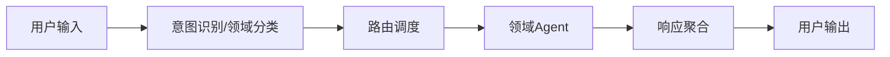

# 全智能体架构文档

> 本文档描述了多智能体系统的整体架构、技术选型与推荐项目结构，适用于本地和远程多端部署场景。

## 一、功能描述

 支持用户自然语言输入，自动识别意图与领域，路由到对应领域智能体（Agent）处理。
 多领域智能体协作，涵盖财务、医疗、IT、法律等场景。
- 智能体可自主学习，持续更新知识库（长期记忆）
- 支持PC本地部署，手机App远程访问。
- 实时交互、知识问答、任务自动化、数据分析等功能。
- 日志、监控、权限管理、数据安全保障。

## 二、架构设计

流程图（简要）



### 用户输入层
- 支持文本/语音输入，预处理。

### 意图识别与领域分类
- NLP模型识别意图、领域，输出标签。

### 路由调度层
- 根据领域标签分发请求到对应Agent，支持多Agent协作。

### 领域智能体（Agent）
- 每个Agent独立服务，专注特定领域，统一接口（RESTful/gRPC）。

### 响应聚合层
- 收集Agent响应，格式化、融合、输出给用户。

### 日志与监控
- 全链路日志、异常告警、性能分析。

### 安全与权限
- 用户认证、数据脱敏。

## 三、技术选型

### 后端
- Node.js（Express）为主后端
- Docker容器化部署
- RESTful API、WebSocket

### 前端/手机App
- Flutter（桌面端、H5页面、移动端均支持）
- HTTPS、WebSocket通信

### 数据存储
- SQLite（本地）记录用户系统配置

### 长期记忆与知识增强
- LanceDb（本地）使用RAG数据库作为系统长期记忆，实现知识检索增强（Retrieval-Augmented Generation），支持智能体持续学习与知识积累。

### 网络与安全
- HTTPS（Let’s Encrypt）、frp/ngrok内网穿透

---
**术语说明：**
- RAG（Retrieval-Augmented Generation）：检索增强生成，结合知识库检索与生成式AI，提升智能体长期记忆与知识问答能力。
- 向量数据库：用于存储和检索文本、图片等数据的向量表示，支撑RAG能力。

### 日志与监控
- Winston

### AI能力
- 云API（OpenAI、百度、阿里等）， 用户按需自主配置

## 四、项目结构

```text
cloudbrain/
├── backend/           # Node.js 主后端服务
│   ├── src/
│   ├── package.json
│   └── ...
├── frontend/          # Flutter 前端（桌面/Web/移动端）
│   ├── lib/
│   ├── pubspec.yaml
│   └── ...
├── docs/              # 项目文档
├── deploy/            # Docker、CI/CD 配置
├── database/          # 数据库相关文件
└── README.md          # 项目说明
```

## 五、部署方案

- **PC本地部署**：后端服务、数据库、前端均可运行于普通PC，推荐Docker一键部署。
- **手机App远程访问**：App通过HTTPS/WebSocket连接PC后端，支持内网穿透。
- 支持个人、团队、企业多场景，易于扩展和维护。

