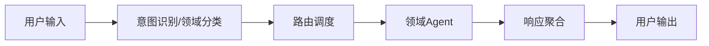

# 全智能体架构文档

> 本文档描述了多智能体系统的整体架构、技术选型与推荐项目结构，适用于本地和远程多端部署场景。

## 一、功能描述（从用户视角）

核心目标：提供一个可本地部署、可远程访问的多智能体系统，支持知识问答、任务自动化和数据分析。

- 支持用户自然语言输入，自动识别意图与领域，路由到对应领域智能体（Agent）处理。
- 多领域智能体协作，涵盖财务、医疗、IT、法律、创作等场景。
- 每个智能体可自主学习，持续更新自己的知识库（长期记忆）。
- 支持 PC 本地部署，手机 App 或浏览器远程访问。
- 实时交互、知识问答、任务自动化、数据分析等功能。
- 提供日志、监控、权限管理、数据安全等基础能力。

典型使用场景：
- 智能问答：用户就某一领域（如股票、法律条款）提问，对应领域 Agent 结合自身 RAG 知识库给出回答。
- 任务协作：用户发出一个复合任务（如“分析这份财报并生成概要”），由多个 Agent（财务分析、语言润色等）协同完成。
- 持续学习：用户上传新文档或数据，相关 Agent 自动更新其 RAG 知识库，后续问答可利用新知识，允许用户收录每次的输出内容，更新其RAG知识库。

## 二、架构设计

流程图（简要）



### 用户输入层
- 负责接收用户文本/语音输入，并做基础预处理（分段、去噪、剪裁长度等）。
- 前端侧完成大部分输入规范化，后端仅做必要的合法性检查。

### 意图识别与领域分类
- 由代理 Agent 调用大模型识别意图、领域，输出结构化标签，例如：
	- `intent`: `qa` / `task` / `chat` / `analyze` 等
	- `domains`: `["finance", "law"]` 等复合领域
- 对应实现一般位于 `backend/src/services/intent.service.ts`，其内部通过调用 `proxy-agent` 完成实际的意图识别逻辑，对外仍然提供纯函数式接口，便于单元测试。

### 路由调度层
- 根据意图与领域标签选择一个或多个合适的 Agent，构建调用计划（单 Agent / 多 Agent 串行或并行）。
- 对应实现位于 `backend/src/services/router.service.ts`，只关心“调用哪个 Agent、以什么顺序”，不关心具体 Agent 内部实现细节。

### 领域智能体（Agent）
- 每个 Agent 独立封装在 `backend/src/agents/<domain>-agent` 下，专注特定领域，暴露统一接口（HTTP 或内部调用）。
- 每个 Agent 有自己 RAG 数据库来存储自己的知识库（LanceDb，位于 `database/lancedb/<agent>`）。
- 每个 Agent 可以配置自己的大模型（如不同云厂商/不同模型版本）。
- 每个 Agent 有自己的 SKILL 集合，Skill 是可复用的子能力（如“提取财务指标”、“生成大纲”等）。

### 响应聚合层
- 当多 Agent 协作完成任务时，需要统一代理Agent聚合响应（合并结果、去重、排序、摘要）。
- 对应实现位于 `backend/src/services/aggregation.service.ts`，仅处理“如何合并多个 Agent 输出”。

### 日志与监控
- 负责全链路日志记录、异常告警、性能指标采集。
- 日志写入封装在 `backend/src/infra/logger`，对上层暴露统一 Logger 接口，便于后续接入 ELK/第三方服务。

### 安全与权限
- 负责基础安全能力，如本地访问控制、数据脱敏、速率限制等。
- 主要通过 `backend/src/middlewares` 中的中间件实现，例如：IP 白名单、敏感字段脱敏等。单用户场景下通常不需要复杂的账号体系，只需保护本机数据安全即可。

## 三、技术选型

### 后端
- Node.js（Express）为主后端，推荐使用 TypeScript 提升可维护性。
- 部署方式：
	- 开发环境：本地 Node 直接运行，使用 `nodemon` 热重载。
	- 生产环境：Docker 容器化部署，通过 `docker-compose` 一键启动。
- 通信协议：RESTful API + WebSocket（可选，用于流式返回和实时通知）。
- 主要依赖（建议）：
	- Web：`express`, `cors`, `helmet`
	- 数据库：`sqlite3`
	- 日志：`winston`
	- RAG：`lancedb` 相关 SDK

### 前端/手机App
- Flutter（桌面端、H5 页面、移动端均支持），统一一套 UI 代码，多端构建。
- 与后端通过 HTTPS / WebSocket 通信，建议统一以 `/api/*` 为前缀的 REST 接口。
- 状态管理可选择 Provider、Bloc 或 GetX 等方案，建议在 `features/*/viewmodels` 中集中管理。

#### UI 功能模块划分

前端按“功能域”拆分为若干核心页面/模块：

- 会话主页（Chat）：
	- 左侧：对话/任务列表（conversations），支持创建新对话、重命名、删除。
	- 中间：消息区域（messages），按时间顺序展示 user / assistant / agent 的对话气泡。
	- 底部：输入框 + 发送按钮，支持多行输入、回车发送、附件入口（预留）。
- Agent 管理：
	- 展示内置 Agent 列表（proxy-agent、stock-agent、novel-agent 等）。
	- 支持开启/关闭某个 Agent、编辑其名称、简介和可见性（是否出现在 UI 中）。
	- 点击某个 Agent 可进入详情，查看其技能（skills）、工具（tools）和知识库状态（文档数量、最后更新时间等）。
	- 支持每个 Agent 选择不同的模型
- 知识库管理：
	- 按 Agent 维度展示已导入的文档/数据集列表。
	- 提供“导入文档”入口（本地文件/文本粘贴），并显示向量化状态（排队中/已完成/失败）。
	- 支持删除文档、重新向量化等操作。
- 设置（Settings）：
	- 大模型与 API Key 配置（OpenAI、阿里云、百度等）。
	- 代理设置（如使用国内代理/直连）、日志等级、主题（深色/浅色）。
	- 数据相关设置：是否允许自动把对话摘要写入知识库等。
- 引导与帮助（Onboarding/Help）：
	- 首次启动时展示简单步骤：配置 API Key → 选择默认模型 → 体验示例对话。
	- 提供指向 docs 的链接（如架构说明、使用指南）。

#### 典型交互流程示例

- 新建对话：
	1. 用户在左侧点击“新建对话”。
	2. 自动创建一个新的 conversation 记录，并在中间区域显示空白对话界面。
	3. 用户输入问题并发送，前端带上 `conversationId` 调用 `/api/agent/invoke`。

- 查看并管理 Agent：
	1. 用户从侧边栏进入“Agent 管理”。
	2. 列表展示所有已注册的 Agent（读取后端 `/api/agents`）。
	3. 用户点击某个 Agent，可查看其描述、技能列表和知识库概览，并可手动触发“同步知识库”操作。

- 向知识库添加文档：
	1. 用户在“知识库管理”中选择目标 Agent。
	2. 点击“导入文档”，上传本地文件或粘贴文本。
	3. 前端将文件/文本与 Agent 标识一起提交到 `/api/agent/invoke` 或专门的 `/api/agent/ingest` 接口。
	4. 后端完成解析与向量化后，前端在列表中更新文档状态与统计信息。

### 数据存储
- SQLite（本地）记录对话、系统配置等结构化数据，默认单用户场景，不涉及多账号管理。
- 如需并行多实例，可为每个实例使用独立的 SQLite 文件，避免锁冲突。

### 长期记忆与知识增强
- LanceDb（本地）作为向量数据库，用于存储文本、文档等的 Embedding 向量，实现 RAG 能力。
- 每个 Agent 维护自己的向量库，目录建议为 `database/lancedb/<agent-name>`。

### 网络与安全
- 对外统一通过 HTTPS（如使用 Let’s Encrypt 自动签发证书）。
- 内网服务之间可使用 HTTP，但建议在网关层做访问控制与鉴权。

### 数据建模建议（SQLite）
- 采用简单、易扩展的表结构，为后续审计和多 Agent 协作留足空间，场景默认单用户：

	- `conversations`：对话表（id, title, created_at, status 等），用于区分不同对话/任务线程。
	- `messages`：消息表（id, conversation_id, role, content, created_at）。
	- `agent_logs`：Agent 调用日志（id, conversation_id, agent_id, input, output, latency_ms, success_flag 等）。
	- `configs`：系统与 Agent 配置（key, value, scope 等），便于做界面化配置。

- 其中 `agent_logs` 与 LanceDb 中的向量数据通过文档 ID 进行关联，便于从日志追溯到使用过的知识片段。

---
**术语说明：**
- RAG（Retrieval-Augmented Generation）：检索增强生成，结合知识库检索与生成式AI，提升智能体长期记忆与知识问答能力。
- 向量数据库：用于存储和检索文本、图片等数据的向量表示，支撑RAG能力。

### 日志与监控
- Winston 作为基础日志库，封装在 `backend/src/infra/logger` 中统一使用。
- 后续可接入 Prometheus + Grafana 等监控体系，通过 `backend/src/infra/metrics` 采集指标。

### AI能力
- 统一通过 `backend/src/integrations` 封装各云厂商大模型的 SDK：
	- `openai.client.ts`
	- `aliyun.client.ts`
	- `baidu.client.ts`
- 用户可在配置文件或管理界面中为不同 Agent 选择不同的模型供应商与模型版本。

## 四、项目结构

```text
cloudbrain/
├── backend/                           # Node.js 主后端服务
│   ├── src/
│   │   ├── app.js                    # 应用入口（挂载中间件、路由）
│   │   ├── config/                   # 配置相关（环境变量、模型/Agent 配置）
│   │   │   ├── env/                  # 各环境配置（dev/prod 等）
│   │   │   └── agents.config.ts      # 各领域 Agent 的路由 & 模型配置
│   │   ├── routes/                   # HTTP 路由层（RESTful API）
│   │   │   ├── index.ts              # 路由聚合
│   │   │   ├── user.routes.ts        # 用户与权限相关接口
│   │   │   ├── intent.routes.ts      # 意图识别 & 领域分类接口
│   │   │   ├── agent.routes.ts       # 调用具体 Agent 的统一入口
│   │   │   └── admin.routes.ts       # 运维、监控、配置管理
│   │   ├── controllers/              # 控制器层（请求编排、参数校验）
│   │   │   ├── intent.controller.ts
│   │   │   ├── router.controller.ts
│   │   │   ├── agent.controller.ts
│   │   │   └── health.controller.ts
│   │   ├── services/                 # 业务服务层（核心业务逻辑）
│   │   │   ├── intent.service.ts     # 调用 proxy-agent 做意图识别、领域分类
│   │   │   ├── router.service.ts     # 根据意图/领域标签路由到对应 Agent
│   │   │   ├── aggregation.service.ts# 聚合多 Agent 响应
│   │   │   ├── user.service.ts
│   │   │   └── auth.service.ts
│   │   ├── agents/                   # 领域智能体（业务子模块）
│   │   │   ├── proxy-agent/          # 代理 Agent
│   │   │   ├── stock-agent/          # 股票/理财 Agent
│   │   │   │   ├── rag/              # 本 Agent 的 RAG 相关逻辑
│   │   │   │   │   ├── loader.ts     # 知识库加载/清洗
│   │   │   │   │   ├── embedder.ts   # 文本向量化
│   │   │   │   │   └── retriever.ts  # 检索接口封装
|	|	│   │   │   │   ├── prompts/          # Prompt 模板
|	|	│   │   │   │   ├── tools/            # 该 Agent 可调用的外部工具
|	|	│   │   │   │   ├── skills/           # 本 Agent 的技能定义（可复用的子能力/Skill）
|	|	│   │   │   │   ├── memory/           # 本 Agent 的长期/短期记忆抽象
|	|	│   │   │   │   └── index.ts          # 对外暴露的统一调用入口
│   │   │   ├── novel-agent/          # 小说/创作 Agent（结构同上）
│   │   │   └── ...
│   │   ├── models/                   # 数据模型（如 SQLite ORM 定义）
│   │   │   ├── user.model.ts
│   │   │   ├── session.model.ts
│   │   │   └── agent-log.model.ts
│   │   ├── middlewares/              # 中间件（日志、鉴权、限流等）
│   │   │   ├── auth.middleware.ts
│   │   │   ├── logger.middleware.ts
│   │   │   └── error.middleware.ts
│   │   ├── integrations/             # 第三方/云端大模型 & 外部服务集成
│   │   │   ├── openai.client.ts
│   │   │   ├── aliyun.client.ts
│   │   │   ├── baidu.client.ts
│   │   │   └── ...
│   │   ├── infra/                    # 基础设施封装
│   │   │   ├── db/                   # SQLite & LanceDb 封装
│   │   │   │   ├── sqlite.client.ts
│   │   │   │   └── lancedb.client.ts
│   │   │   ├── logger/               # 日志（Winston 封装）
│   │   │   │   └── logger.ts
│   │   │   ├── cache/                # 可选：缓存（如本地缓存、Redis 客户端）
│   │   │   └── metrics/              # 可选：监控/指标上报
│   │   ├── utils/                    # 工具函数（通用方法）
│   │   └── index.ts                  # 导出整个后端应用
│   ├── tests/                        # 单元测试/集成测试
│   ├── package.json
│   └── ...
├── frontend/                         # Flutter 前端（桌面/Web/移动端）
│   ├── lib/
│   │   ├── main.dart                 # 入口
│   │   ├── core/                     # 全局配置 & 基础能力
│   │   │   ├── config/               # 环境配置、后端地址等
│   │   │   ├── theme/                # 主题、颜色、样式
│   │   │   └── router/               # 路由管理
│   │   ├── features/                 # 按功能拆分模块
│   │   │   ├── chat/                 # 聊天/对话界面
│   │   │   │   ├── pages/
│   │   │   │   ├── widgets/
│   │   │   │   └── viewmodels/       # 状态管理（如 Provider/Bloc/GetX 等）
│   │   │   ├── agents/               # 智能体管理（列表、配置页面）
│   │   │   ├── settings/             # 系统设置
│   │   │   └── onboarding/           # 首次使用引导
│   │   ├── services/                 # 调用后端 API 的封装
│   │   ├── models/                   # 前端数据模型（DTO）
│   │   └── utils/                    # 通用工具（格式化、扩展方法等）
│   ├── assets/                       # 资源文件（图片、图标、国际化文案）
│   ├── pubspec.yaml
│   └── ...
├── docs/                             # 项目文档
│   ├── architecture.md               # 架构设计说明
│   ├── api.md                        # 后端 API 文档
│   ├── agents-design.md              # 各领域智能体设计说明
│   └── deploy-guide.md               # 部署与运维手册
├── deploy/                           # Docker、CI/CD 配置
│   ├── docker-compose.yml
│   ├── backend.Dockerfile
│   ├── frontend.Dockerfile
│   ├── nginx.conf                    # 如有前后端反向代理
│   └── ci-cd/                        # CI/CD 脚本（GitHub Actions 等）
├── database/                         # 数据库相关文件
│   ├── migrations/                   # SQLite 初始化 & 迁移脚本
│   ├── seeds/                        # 初始化种子数据
│   └── lancedb/                      # LanceDb 数据文件（向量库）
└── README.md                         # 项目说明
```

## 五、模块职责说明（按目录）

- backend/src/config：集中管理环境变量、Agent 与模型配置，确保多环境（开发/测试/生产）行为一致、可追踪。
- backend/src/routes + controllers：负责 HTTP 接口定义与入参/出参规范，不写复杂业务，只做编排与校验。
- backend/src/services：承载主要业务逻辑，如意图识别、路由调度、响应聚合、用户 & 权限处理等。
- backend/src/agents：每个子目录是一个领域 Agent，内部通过 rag + prompts + tools + skills + memory 组织其知识库、工具调用和长期记忆能力。
- backend/src/infra：对数据库（SQLite）、向量库（LanceDb）、日志、缓存、监控等基础设施做统一封装，业务层只依赖接口不关心细节。
- backend/src/middlewares：放置鉴权、日志、错误处理、限流等横切关注点，中间件越通用越好，避免与具体业务强耦合。
- frontend/lib/core：全局配置、主题、路由等前端基础能力，其他 feature 模块共享。
- frontend/lib/features：按照“功能域”拆分模块（chat/agents/settings 等），每个模块内部自包含页面、组件和状态管理。
- database：统一管理数据库初始化脚本、迁移、种子数据以及 LanceDb 物理数据目录，方便备份与迁移。
- docs + deploy：前者记录架构/API/Agent 设计，后者提供 Docker、CI/CD 等自动化脚本，保证从文档到部署的闭环。

## 六、Agent 规范与接口约定

### 6.1 Agent 输入输出规范

统一抽象一个 Agent 的输入/输出，便于路由层与前端复用：

- Agent 输入（示意）：
	- `id`：Agent 标识，例如 `stock-agent`、`novel-agent`。
	- `conversationId`：对话 ID，用于关联上下文与记忆。
	- `query`：用户自然语言请求。
	- `context`：可选的上文信息（历史对话、外部数据等）。
	- `options`：如温度、最大 Token 数量等推理参数。
- Agent 输出（示意）：
	- `answer`：主要文本响应。
	- `reasoning`：可选的推理过程或链路说明（用于调试）。
	- `usedDocs`：RAG 检索到的文档片段引用（便于前端高亮）。
	- `toolCalls`：本次调用中使用过的外部工具列表。

### 6.2 HTTP 接口约定

后端对前端暴露统一 API 规范，方便前端与文档生成：

- 基础路径：`/api`
- 示例接口：
	- `POST /api/intent/classify`：意图识别与领域分类。
	- `POST /api/agent/invoke`：调用某个或某组 Agent 完成任务。
	- `GET  /api/agents`：获取可用 Agent 列表与配置概要。
	- `GET  /api/health`：健康检查。
- 错误返回统一结构：
	- `code`：业务错误码（如 `AGENT_NOT_FOUND`）。
	- `message`：错误描述。
	- `detail`：可选，便于调试的详细信息。

### 6.3 Agent 目录与实现约定

以 `stock-agent` 为例，每个 Agent 目录内建议包含：

- `rag/`：与本 Agent 相关的 RAG 流程（加载 -> 嵌入 -> 检索）。
- `prompts/`：Prompt 模板与相关配置。
- `tools/`：可调用的外部工具封装（HTTP 调用、脚本任务等）。
- `skills/`：与领域相关的原子技能，组合成更复杂任务。
- `memory/`：对会话级记忆与长期知识的统一抽象（如最近 N 轮对话）。
- `index.ts`：导出该 Agent 的对外调用入口函数，例如 `runStockAgent(input)`。

### 6.4 proxy-agent 职责与调用流程

proxy-agent 作为“中枢代理”，主要负责：

- 统一接收来自前端或路由层的原始用户请求（含 query、上下文等）。
- 调用大模型完成意图识别与领域分类，输出标准化标签（intent, domains 等）。
- 基于系统配置和当前上下文，规划此次调用所需的 Agent 组合与执行顺序（简单任务可能只调用一个 Agent，复杂任务可能需要多个 Agent 串行/并行工作）。
- 在需要时调用各领域 Agent 的 `skills` 和 `tools`，并将中间结果写入 `agent_logs` 以便审计与回放。

实现方式：
- 将 proxy-agent 实现为 `backend/src/agents/proxy-agent/index.ts` 中的一个主函数，例如 `runProxyAgent(input)`。
- `intent.service.ts` 只负责把 HTTP 请求转换为标准化输入结构，调用 `runProxyAgent`，并把结果再转换为 HTTP 响应，不直接写业务逻辑。
- proxy-agent 内部可根据 `intent` 决定：是直接回答、转发给单一 Agent，还是构造一个多 Agent 工作流（workflow）。

## 七、部署方案

- **PC本地部署**：后端服务、数据库、前端均可运行于普通PC，推荐Docker一键部署。
- **手机App远程访问**：App通过HTTPS/WebSocket连接PC后端，支持内网穿透。
- 支持个人、团队、企业多场景，易于扩展和维护。

