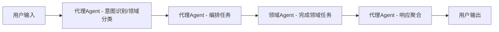

# 全智能体架构文档

> 本文档描述了多智能体系统的整体架构、技术选型与项目结构，适用于本地和远程多端部署场景。

## 一、功能描述（从用户视角）

核心目标：提供一个可本地部署、可远程访问的多智能体系统，支持知识问答、任务自动化和数据分析。

- 支持用户自然语言输入，通过代理Agent，自动识别意图与领域，编排对应领域智能体（Agent）处理，由代理Agent汇总输出。
- 多领域智能体协作，涵盖财务、医疗、IT、法律、创作等场景。
- 每个智能体可自主学习，持续更新自己的知识库（长期记忆）。
- 支持 PC 本地部署，手机 App 或浏览器远程访问。
- 实时交互、知识问答、任务自动化、数据分析等功能。
- 提供日志、监控、权限管理、数据安全等基础能力。

典型使用场景：
- 智能问答：用户就某一领域（如股票、法律条款）提问，对应领域 Agent 结合自身 RAG 知识库给出回答。
- 任务协作：用户发出一个复合任务（如“分析这份财报并生成概要”），由多个 Agent（财务分析、语言润色等）协同完成。
- 持续学习：用户上传新文档或数据，相关 Agent 自动更新其 RAG 知识库，后续问答可利用新知识，允许用户收录每次的输出内容，更新其RAG知识库。

## 二、架构设计

流程图（简要）



### 用户输入层
- 负责接收用户文本/语音/图片输入，并做基础预处理（分段、去噪、剪裁长度等）。
- 前端侧完成大部分输入规范化，后端仅做必要的合法性检查。

### 意图识别与领域分类
- 由代理 Agent 调用大模型识别意图，编排领域任务，输出结构化标签（如 `intent` / `domains` / `confidence`），并为后续路由与编排提供依据。
	- 例如：帮我讲解下下面的题目：xxx?
		由代理 Agent 获取可用的领域 Agent 列表和模型配置，通过大模型识别出需要用到 `teacher-agent`，创建调用老师 Agent 来做题目讲解，把结果返回给代理 Agent，再由代理 Agent 格式化输出。
- 如果没有匹配的领域 Agent，由代理 Agent 直接完成，并向用户提示当前是由通用 Agent 回答。
- 对应实现一般位于 `backend/src/services/intent.service.ts`，其内部通过调用基于 LangChain 实现的 `proxy-agent`（当前默认使用 OpenAI Chat 模型，通过 `OPENAI_API_KEY` 配置）完成实际的意图识别逻辑，对外仍然提供纯函数式接口，便于单元测试。

### 路由调度层
- 根据意图与领域标签选择一个或多个合适的 Agent，构建调用计划（单 Agent / 多 Agent 串行或并行）。
- 对应实现位于 `backend/src/services/router.service.ts`，只关心“调用哪个 Agent、以什么顺序”，不关心具体 Agent 内部实现细节。

### 领域智能体（Agent）
- 每个配置驱动的 Domain Agent 独立封装在 `backend/agents/<domain>-agent` 下（纯配置，不含代码），代码驱动的 Agent（如 proxy-agent）保留在 `backend/src/agents/` 下。
- 每个 Agent 有自己 RAG 数据库来存储自己的知识库（LanceDb，默认位于 Agent 目录下的 `lancedb/` 子目录，如 `agents/stock-agent/lancedb/`）。
- 每个 Agent 可以配置自己的大模型（如不同云厂商/不同模型版本）。
- 每个 Agent 有自己的 SKILL 集合，Skill 以 Markdown 文件定义（遵循 OpenSkill 标准），元数据预加载供路由决策，内容通过 `use_skill` 工具由 LLM 按需加载。
- 每个 Agent 可通过 `query_knowledge` 工具查询自己的 RAG 知识库（LanceDB 向量检索），LLM 在需要时自主调用。
- 各 Agent 内部通过 `runWithSkills()` 统一调用器实现 LLM + tool-calling 循环，同时支持 Skill 工具和 RAG 知识检索工具。

### 响应聚合层
- 当多 Agent 协作完成任务时，需要统一代理Agent聚合响应（合并结果、去重、排序、摘要）。
- 对应实现位于 `backend/src/services/aggregation.service.ts`，主要通过 LangChain 的 Chain/Runnable 组合，处理“如何合并多个 Agent 输出”。

### 日志与监控
- 负责全链路日志记录、异常告警、性能指标采集。
- 日志写入封装在 `backend/src/infra/logger`，对上层暴露统一 Logger 接口，便于后续接入 ELK/第三方服务。

### 安全与权限
- 负责基础安全能力，如本地访问控制、数据脱敏、速率限制等。
- 主要通过 `backend/src/middlewares` 中的中间件实现，例如：IP 白名单、敏感字段脱敏等。单用户场景下通常不需要复杂的账号体系，只需保护本机数据安全即可。

### 任务执行与恢复
- 后端作为长驻服务运行，负责管理所有 Agent 任务的生命周期，前端 UI 仅作为“遥控器”和“显示器”。
- 前端窗口最小化、关闭、应用退出或设备锁屏时，不会中断后端正在执行的任务；任务状态完全由后端控制。
- 当前端重新打开或从后台恢复到前台时，需要主动从后端拉取最新数据（对话列表、当前对话消息、任务列表、各 Agent 与知识库状态等），刷新 UI 后再允许用户继续操作。
- 后端在执行长任务时，会将任务状态、进度和中间结果持续写入 SQLite（以及必要时写入 LanceDb），以便在进程意外退出或升级重启后可以自动恢复或重试。

## 三、技术选型

### 后端
- Node.js（Express + LangChain JS）为主后端与智能体编排框架，推荐使用 TypeScript 提升可维护性。
- 部署方式：
	- 开发环境：本地 Node 直接运行，使用 `nodemon` 热重载。
	- 生产环境：Docker 容器化部署，通过 `docker-compose` 一键启动。
- 通信协议：RESTful API + WebSocket（可选，用于流式返回和实时通知）。
- 主要依赖：
	- Web 框架：`express`, `cors`, `helmet`
	- 数据库：`better-sqlite3`（同步、无需编译的 SQLite 绑定）
	- 日志：`winston`
	- RAG / 向量库：`@lancedb/lancedb`（原生 LanceDB 客户端）
	- 嵌入向量：`OpenAIEmbeddings`（来自 `@langchain/openai`，兼容所有 OpenAI-compatible 端点）
	- LLM 抽象 & Agent 编排：`langchain`, `@langchain/core`, `@langchain/openai`
	- Tool schema 定义：`zod`（用于 `DynamicStructuredTool` 的参数 schema）
	- 环境变量：`dotenv`
	- 开发工具：`typescript`, `ts-node`, `@types/node`, `@types/express`

#### 后端 package.json 脚本约定

```jsonc
{
  "scripts": {
    "dev": "npx ts-node src/index.ts",       // 开发环境直接运行
    "build": "tsc",                           // TypeScript 编译
    "start": "node dist/index.js",            // 生产环境运行
    "migrate": "ts-node src/infra/db/migrate.ts", // 执行数据库迁移
    "seed": "ts-node src/infra/db/seed.ts"    // 导入种子数据
  }
}
```

#### 后端 tsconfig.json 约定

```jsonc
{
  "compilerOptions": {
    "target": "ES2020",
    "module": "commonjs",
    "lib": ["ES2020"],
    "outDir": "dist",
    "rootDir": "src",
    "strict": true,
    "esModuleInterop": true,
    "resolveJsonModule": true,
    "skipLibCheck": true,
    "forceConsistentCasingInFileNames": true
  },
  "include": ["src"],
  "exclude": ["node_modules", "dist", "tests"]
}
```

#### 环境变量（.env）

在 `backend/` 目录下使用 `.env` 文件加载环境变量（通过 `dotenv`）：

```env
# === 数据库 ===
SQLITE_DB_PATH=../database/cloudbrain.db

# === 服务 ===
PORT=3000
NODE_ENV=development
LOG_LEVEL=debug

# === Agent 发现目录（逗号分隔，相对于 backend/ 或绝对路径，留空则仅扫描内置 agents/） ===
# AGENT_DIRS=../custom-agents,/opt/extra-agents
```

### 前端/手机App
- Flutter（桌面端、H5 页面、移动端均支持），统一一套 UI 代码，多端构建。
- 与后端通过 HTTPS / WebSocket 通信，建议统一以 `/api/*` 为前缀的 REST 接口。
- 状态管理可选择 Provider、Bloc 或 GetX 等方案，建议在 `features/*/viewmodels` 中集中管理。

#### UI 功能模块划分

前端按“功能域”拆分为若干核心页面/模块：

- 会话主页（Chat）：
	- 左侧：对话/任务列表（conversations），支持创建新对话、重命名、删除。
	- 中间：消息区域（messages），按时间顺序展示 user / assistant / agent 的对话气泡。
	- 底部：输入框 + 发送按钮，支持多行输入、回车发送、附件入口（预留）。
- Agent 管理：
	- 展示内置 Agent 列表（proxy-agent、stock-agent、novel-agent 等）。
	- 支持开启/关闭某个 Agent、编辑其名称、简介和可见性（是否出现在 UI 中）。
	- 点击某个 Agent 可进入详情，查看其技能（skills）、工具（tools）和知识库状态（文档数量、最后更新时间等）。
	- 支持每个 Agent 从设置里大模型中选择不同的模型
- 知识库管理：
	- 按 Agent 维度展示已导入的文档/数据集列表。
	- 提供“导入文档”入口（本地文件/文本粘贴），并显示向量化状态（排队中/已完成/失败）。
	- 支持删除文档、重新向量化等操作。
	- 可以手动在会话窗口可以把对话结果导入到知识库，当自动把对话摘要写入知识库关闭时。
- 设置（Settings）：
	- 大模型配置（API Key、API URL、默认模型），所有模型通过 OpenAI 兼容 API 调用。
	- 代理设置（如使用国内代理/直连）、日志等级、主题（深色/浅色）。
	- 数据相关设置：是否允许自动把对话摘要写入知识库等。
- 引导与帮助（Onboarding/Help）：
	- 首次启动时展示简单步骤：配置 API Key → 选择默认模型 → 体验示例对话。
	- 提供指向 docs 的链接（如架构说明、使用指南）。

#### 典型交互流程示例

- 新建对话：
	1. 用户在左侧点击“新建对话”。
	2. 自动创建一个新的 conversation 记录，并在中间区域显示空白对话界面。
	3. 用户输入问题并发送，前端带上 `conversationId` 调用 `/api/agent/invoke`。
	4. 如果此时最小化、关闭窗口或锁屏，后端仍继续执行；用户下次打开应用或从后台恢复时，通过重新加载该 `conversationId` 下的 `messages` 与 `tasks`，看到已完成或进行中的结果。

- 查看并管理 Agent：
	1. 用户从侧边栏进入“Agent 管理”。
	2. 列表展示所有已注册的 Agent（读取后端 `/api/agents`）。
	3. 用户点击某个 Agent，可查看其描述、技能列表和知识库概览，并可手动触发“同步知识库”操作。

- 向知识库添加文档：
	1. 用户在“知识库管理”中选择目标 Agent。
	2. 点击“导入文档”，上传本地文件或粘贴文本。
	3. 前端将文件/文本与 Agent 标识一起提交到 `/api/agent/invoke` 或专门的 `/api/agent/ingest` 接口。
	4. 后端完成解析与向量化后，前端在列表中更新文档状态与统计信息；如果过程中前端最小化、关闭或进入后台，下次打开会从 `tasks` 和 `agent_logs` 中恢复并刷新状态。

- 应用重新打开/从后台恢复：
	1. 应用启动或从后台回到前台时，首先调用后端接口获取最新的对话列表、当前选中对话的消息、未完成任务列表以及各 Agent/知识库状态。
	2. 前端根据返回的数据重建 UI 状态（侧边栏列表、消息区、任务进度、Agent/知识库面板等）。
	3. 在数据刷新完成后，用户可以继续在现有对话中提问或发起新任务。

### 数据存储
- SQLite（本地）记录对话、任务、系统配置等结构化数据，默认单用户场景，不涉及多账号管理。
- 如需并行多实例，可为每个实例使用独立的 SQLite 文件，避免锁冲突。

### 长期记忆与知识增强
- LanceDb（本地）作为向量数据库，用于存储文本、文档等的 Embedding 向量，实现 RAG 能力。
- 每个 Agent 维护自己的向量库，默认目录为 Agent 目录下的 `lancedb/` 子目录（如 `backend/agents/stock-agent/lancedb/`）。若 Agent 未提供 `dataDir`（兜底场景），回退到集中目录 `database/lancedb/<agent-id>`。
- RAG 流程由集中式服务 `rag-service.ts` 统一管理（文档切片 → OpenAI Embeddings 向量化 → LanceDB 写入/检索），并通过 `rag-tool.ts` 将检索能力封装为 `query_knowledge` LangChain 工具，供 LLM 在 tool-calling 循环中按需调用。

### 网络与安全
- 对外统一通过 HTTPS（如使用 Let’s Encrypt 自动签发证书）。
- 内网服务之间可使用 HTTP，但建议在网关层做访问控制与鉴权。

### 数据建模（SQLite）

采用简单、易扩展的表结构，场景默认单用户。以下为各表的 TypeScript 类型定义，同时也是 SQLite 表结构的直接映射：

```typescript
/** conversations 表 — 对话/任务线程 */
interface ConversationRecord {
  id: string;                  // UUID
  title: string;               // 对话标题（可自动生成或用户编辑）
  status: 'active' | 'archived' | 'closed';
  created_at: string;          // ISO 8601
  updated_at: string;
}

/** messages 表 — 对话消息 */
interface MessageRecord {
  id: string;                  // UUID
  conversation_id: string;     // FK → conversations.id
  role: 'user' | 'assistant' | 'system' | 'agent';
  content: string;
  agent_id?: string;           // 当 role='agent' 时标识来源 Agent
  created_at: string;
}

/** agent_logs 表 — Agent 调用日志 */
interface AgentLogRecord {
  id: string;
  conversation_id: string;
  agent_id: string;
  input: string;               // JSON 字符串
  output: string;              // JSON 字符串
  latency_ms: number;
  success_flag: boolean;
  created_at: string;
}

/** tasks 表 — 长任务追踪与恢复 */
interface TaskRecord {
  id: string;
  conversation_id?: string;
  type: 'agent_invoke' | 'ingest' | 'maintenance';
  status: 'pending' | 'running' | 'succeeded' | 'failed' | 'canceled';
  payload: string;             // JSON 字符串（任务输入详情）
  result?: string;             // JSON 字符串（任务输出详情）
  progress?: number;           // 0-100，可选进度百分比
  error?: string;
  created_at: string;
  updated_at: string;
  last_heartbeat_at?: string;  // 长任务心跳，便于检测假死
}

/** configs 表 — 系统与 Agent 配置 */
interface ConfigRecord {
  key: string;                 // 如 "agent_model_mapping"、"default_model"
  value: string;               // JSON 字符串
  scope: 'system' | 'agent';  // 配置作用域
  updated_at: string;
}
```

补充说明：
- `agent_logs` 与 LanceDb 中的向量数据通过文档 ID 进行关联，便于从日志追溯到使用过的知识片段。
- `tasks.payload` / `tasks.result` 存储为 JSON 字符串，包含与具体任务相关的输入/输出详情。
- `configs.key` 示例：`"agent_model_mapping"`（集中存放 Agent 与模型的映射关系）、`"default_model"` 等，value 存放 JSON 字符串，后端启动和运行时始终以数据库中的配置为准。
- **模型与 Agent 的集中绑定关系以数据库为唯一真源**。

---
**术语说明：**
- RAG（Retrieval-Augmented Generation）：检索增强生成，结合知识库检索与生成式AI，提升智能体长期记忆与知识问答能力。
- 向量数据库：用于存储和检索文本、图片等数据的向量表示，支撑RAG能力。

### 日志与监控
- Winston 作为基础日志库，封装在 `backend/src/infra/logger` 中统一使用。
- 后续可接入 Prometheus + Grafana 等监控体系，通过 `backend/src/infra/metrics` 采集指标。

### AI能力
- 统一通过 `backend/src/integrations` 封装大模型调用：
	- `openai.client.ts` —— 所有模型均通过 OpenAI 兼容 API 调用
	- `llm.factory.ts` —— LLM 工厂，根据配置创建 ChatModel 实例
- 用户只需配置统一的 API Key、API URL 和默认模型，即可对接 OpenAI 及所有兼容 OpenAI API 的大模型服务。
- LangChain 作为统一的 LLM 抽象层，业务代码优先依赖 LangChain 的 LLM/ChatModel 接口，由 integrations 提供底层客户端实现。

#### 模型与 Agent 配置示例

- 将「Agent 与模型」的绑定关系集中存放在 SQLite 数据库中，以数据库为唯一真源：
	- 可以在 `configs` 表中使用 `key = "agent_model_mapping"` 存一条 JSON 配置；
	- 或者设计专门的 `agents` / `agent_models` / `agent_settings` 等表，便于更细粒度管理；
	- 后端启动时从数据库加载这些配置，并可通过管理界面/API 在线修改，修改后立即生效。
- 下例是存放在 `configs.value`（或专门配置表的 value 字段）中的伪 JSON 结构示例：
	```json
	{
	  "defaultModel": "gpt-4.1-mini",
	  "agents": {
	    "proxy-agent": {
	      "enabled": true,
	      "model": "gpt-4.1-mini"
	    },
	    "stock-agent": {
	      "enabled": true,
	      "model": "qwen-long"
	    },
	    "novel-agent": {
	      "enabled": true,
	      "model": "gpt-4.1"
	    }
	  }
	}
	```

- 后端中的 `backend/src/config` 模块只负责读取数据库配置（必要时提供默认种子数据），不再作为模型与 Agent 关系的长期存储位置。
- 环境变量定义详见"后端"章节的 `.env` 说明。

## 四、项目结构

```text
cloudbrain/
├── backend/                           # Node.js 主后端服务
│   ├── src/
│   │   ├── app.ts                    # 应用入口（挂载中间件、路由）
│   │   ├── config/                   # 配置相关（环境变量、模型/Agent 配置）
│   │   │   ├── env/                  # 可选：各环境配置（dev/prod 等）
│   │   │   └── agents.config.ts      # 可选：Agent & 模型默认映射的本地种子配置，实际生效配置以数据库为准
│   │   ├── routes/                   # HTTP 路由层（RESTful API）
│   │   │   ├── index.ts              # 路由聚合
│   │   │   ├── intent.routes.ts      # 意图识别 & 领域分类接口
│   │   │   ├── agent.routes.ts       # 调用具体 Agent 的统一入口
│   │   │   ├── chat.routes.ts        # 对话管理（CRUD conversations/messages）
│   │   │   ├── knowledge.routes.ts   # 知识库导入/管理接口
│   │   │   └── admin.routes.ts       # 运维、监控、配置管理
│   │   ├── controllers/              # 控制器层（请求编排、参数校验）
│   │   │   ├── intent.controller.ts
│   │   │   ├── agent.controller.ts
│   │   │   ├── chat.controller.ts
│   │   │   ├── knowledge.controller.ts
│   │   │   └── health.controller.ts
│   │   ├── services/                 # 业务服务层（核心业务逻辑）
│   │   │   ├── intent.service.ts     # 调用 proxy-agent 做意图识别、领域分类
│   │   │   ├── router.service.ts     # 根据意图/领域标签路由到对应 Agent
│   │   │   ├── aggregation.service.ts # 聚合多 Agent 响应
│   │   │   ├── chat.service.ts       # 对话/消息 CRUD
│   │   │   └── task.service.ts       # 任务生命周期管理（创建/轮询/恢复）
│   │   ├── agents/                   # 领域智能体（业务子模块）
│   │   │   ├── agent-discovery.ts    # Agent 自动发现与注册（扫描目录、注入 dataDir / loadedSkills）
│   │   │   ├── base-agent.ts          # Domain Agent 工厂（createDomainAgent，消除重复代码）
│   │   │   ├── skill-loader.ts       # Skill 加载器（扫描 skills/*.md，解析 YAML frontmatter + 内容）
│   │   │   ├── skill-tool.ts         # Skill → LangChain 工具（use_skill，OpenSkill 标准）
│   │   │   ├── skill-runner.ts       # Skill + RAG 增强的 LLM 调用器（tool-calling 循环）
│   │   │   ├── rag-service.ts        # RAG 核心服务（文档切片/嵌入/LanceDB 入库/向量检索）
│   │   │   ├── rag-tool.ts           # RAG → LangChain 工具（query_knowledge）
│   │   │   ├── proxy-agent/          # 代理 Agent
│   │   │   │   ├── prompts/          # Prompt 模板（classify / aggregate）
│   │   │   │   ├── skills/           # proxy-agent 的 Skill（aggregate.md, summarize.md）
│   │   │   │   └── index.ts          # 中枢编排入口
│   │   │   ├── stock-agent/          # 股票/理财 Agent（配置驱动，零代码）
│   │   │   │   ├── agent.json        # Agent 配置（id, name, description, skills, defaultTemperature）
│   │   │   │   ├── prompt.md         # System Prompt（定义 Agent 人设和能力范围）
│   │   │   │   └── skills/           # 本 Agent 的 Skill（calculate-metrics.md, risk-analysis.md）
│   │   │   ├── teacher-agent/        # 老师 Agent（配置驱动）
│   │   │   │   ├── agent.json
│   │   │   │   ├── prompt.md
│   │   │   │   └── skills/
│   │   │   ├── novel-agent/          # 小说/创作 Agent（配置驱动）
│   │   │   │   ├── agent.json
│   │   │   │   └── prompt.md
│   │   │   ├── movie-agent/          # 影视推荐/解析 Agent（配置驱动）
│   │   │   │   ├── agent.json
│   │   │   │   └── prompt.md
│   │   │   └── ...
│   │   ├── models/                   # 数据模型（SQLite 表定义 & TypeScript 类型）
│   │   │   ├── conversation.model.ts # conversations 表
│   │   │   ├── message.model.ts      # messages 表
│   │   │   ├── agent-log.model.ts    # agent_logs 表
│   │   │   ├── task.model.ts         # tasks 表
│   │   │   └── config.model.ts       # configs 表
│   │   ├── middlewares/              # 中间件（日志、限流、错误处理等）
│   │   │   ├── logger.middleware.ts   # 请求日志
│   │   │   ├── error.middleware.ts    # 全局错误处理
│   │   │   └── rate-limit.middleware.ts # 基础速率限制
│   │   ├── integrations/             # 第三方/云端大模型 & 外部服务集成
│   │   │   ├── openai.client.ts
│   │   │   ├── llm.factory.ts
│   │   │   └── ...
│   │   ├── infra/                    # 基础设施封装
│   │   │   ├── db/                   # SQLite & LanceDb 封装
│   │   │   │   ├── sqlite.client.ts  # better-sqlite3 连接封装
│   │   │   │   ├── lancedb.client.ts # LanceDb 连接封装
│   │   │   │   ├── migrate.ts        # 建表/迁移脚本
│   │   │   │   └── seed.ts           # 种子数据导入
│   │   │   ├── logger/               # 日志（Winston 封装）
│   │   │   │   └── logger.ts
│   │   │   ├── cache/                # 可选：缓存（如本地缓存、Redis 客户端）
│   │   │   └── metrics/              # 可选：监控/指标上报
│   │   ├── types/                    # 共享 TypeScript 类型定义
│   │   │   ├── agent.types.ts        # DomainAgent / AgentInput / AgentOutput / DocReference / ToolCallRecord
│   │   │   ├── api.types.ts          # API 请求/响应类型、ApiError
│   │   │   └── db.types.ts           # 数据库实体类型（ConversationRecord 等）
│   │   ├── utils/                    # 工具函数（通用方法）
│   │   └── index.ts                  # 导出整个后端应用
│   ├── tests/                        # 单元测试/集成测试
│   ├── .env                          # 环境变量（不提交到 Git）
│   ├── .env.example                  # 环境变量模板（提交到 Git）
│   ├── tsconfig.json
│   ├── package.json
│   └── ...
├── frontend/                         # Flutter 前端（桌面/Web/移动端）
│   ├── lib/
│   │   ├── main.dart                 # 入口
│   │   ├── core/                     # 全局配置 & 基础能力
│   │   │   ├── config/               # 环境配置、后端地址等
│   │   │   ├── theme/                # 主题、颜色、样式
│   │   │   └── router/               # 路由管理
│   │   ├── features/                 # 按功能拆分模块
│   │   │   ├── chat/                 # 聊天/对话界面
│   │   │   │   ├── pages/
│   │   │   │   ├── widgets/
│   │   │   │   └── viewmodels/       # 状态管理（如 Provider/Bloc/GetX 等）
│   │   │   ├── agents/               # 智能体管理（列表、配置页面）
│   │   │   ├── settings/             # 系统设置
│   │   │   └── onboarding/           # 首次使用引导
│   │   ├── services/                 # 调用后端 API 的封装
│   │   ├── models/                   # 前端数据模型（DTO）
│   │   └── utils/                    # 通用工具（格式化、扩展方法等）
│   ├── assets/                       # 资源文件（图片、图标、国际化文案）
│   ├── pubspec.yaml
│   └── ...
├── docs/                             # 项目文档
│   ├── architecture.md               # 架构设计说明
│   ├── api.md                        # 后端 API 文档
│   ├── agents-design.md              # 各领域智能体设计说明
│   └── deploy-guide.md               # 部署与运维手册
├── deploy/                           # Docker、CI/CD 配置
│   ├── docker-compose.yml
│   ├── backend.Dockerfile
│   ├── frontend.Dockerfile
│   ├── nginx.conf                    # 如有前后端反向代理
│   └── ci-cd/                        # CI/CD 脚本（GitHub Actions 等）
├── database/                         # 数据库相关文件
│   ├── migrations/                   # SQLite 初始化 & 迁移脚本
│   ├── seeds/                        # 初始化种子数据
│   └── lancedb/                      # LanceDb 数据文件（向量库）
└── README.md                         # 项目说明
```

## 五、模块职责说明（按目录）

- **backend/src/config**：通过 `dotenv` 加载 `.env` 环境变量，提供从 SQLite `configs` 表读取 Agent/模型配置的封装。以数据库为唯一真源；`agents.config.ts` 仅作为首次初始化的种子数据，不覆盖数据库配置。
- **backend/src/routes + controllers**：HTTP 接口定义与入参/出参校验，不写复杂业务逻辑。每个 `xxx.routes.ts` 对应一个 `xxx.controller.ts`。
- **backend/src/services**：承载主要业务逻辑——`intent.service`（意图识别）、`router.service`（路由调度）、`aggregation.service`（响应聚合）、`chat.service`（对话/消息 CRUD）、`task.service`（任务生命周期管理）。
- **backend/agents**：纯配置驱动的 Domain Agent 目录。每个子目录是一个领域 Agent，只包含 `agent.json` + `prompt.md` + 可选 `skills/*.md`，不含代码。由 `agent-discovery.ts` 启动时自动扫描加载。
- **backend/src/agents**：Agent 共享代码和代码驱动的 Agent。共享组件：`base-agent.ts`（所有 Agent 共享的底层基础设施：模型配置解析、ChatModel 创建、RAG 工具构建、短期记忆、统一 LLM 调用流程）、`domain-agent.ts`（`createDomainAgent` 工厂 + `loadAgentConfig` 配置加载器）、`skill-loader.ts`、`skill-tool.ts`、`skill-runner.ts`、`rag-service.ts`、`rag-tool.ts`。代码驱动的 Agent（如 proxy-agent）保留在此处。`agent-discovery.ts` 在启动时自动扫描 `backend/agents/` 目录（以及 `AGENT_DIRS` 配置的目录），优先检查 `agent.json`（配置驱动），否则回退到 `index.ts`（代码驱动），自动注入 `dataDir` 和 `loadedSkills` 并注册到 proxy-agent。
- **backend/src/models**：TypeScript 类型定义与 SQLite 表操作封装（`conversation.model.ts`、`message.model.ts`、`agent-log.model.ts`、`task.model.ts`、`config.model.ts`），每个文件导出 CRUD 函数。
- **backend/src/infra**：对 SQLite（`better-sqlite3`）、LanceDb、Winston 日志等基础设施的封装，业务层只依赖接口不关心细节。其中 `db/migrate.ts` 负责建表和 schema 迁移。
- **backend/src/middlewares**：放置日志、错误处理、速率限制等横切关注点。单用户场景不需要复杂鉴权，仅做基础本机保护。
- **backend/src/integrations**：封装 LLM 调用（统一使用 OpenAI 兼容 API），`openai.client.ts` 导出工厂函数返回 LangChain `BaseChatModel` 实例，`llm.factory.ts` 根据配置创建对应模型。
- **frontend/lib/core**：全局配置、主题、路由等前端基础能力，其他 feature 模块共享。
- **frontend/lib/features**：按"功能域"拆分模块（chat/agents/settings/onboarding），每个模块自包含 pages、widgets 和 viewmodels。
- **frontend/lib/services**：封装对后端 REST API 的调用（`ApiClient` + 各业务 Service），前端其余模块不直接构造 HTTP 请求。
- **database/**：统一管理迁移脚本（`migrations/`）、种子数据（`seeds/`）以及 LanceDb 物理数据目录（`lancedb/`）。
- **docs/ + deploy/**：文档记录架构/API/Agent 设计；部署目录提供 Dockerfile、docker-compose.yml 与 CI/CD 脚本。

## 六、Agent 规范与接口约定

### 6.1 DomainAgent 接口与输入输出规范

每个领域 Agent 必须实现 `DomainAgent` 接口，并从 `index.ts` 以 `export default` 导出，用于自动发现与注册。

```typescript
/** 领域 Agent 接口 — 所有领域 Agent 必须实现 */
interface DomainAgent {
  id: string;                   // 唯一标识，如 "stock-agent"（需与目录名一致）
  name: string;                 // 显示名称，如 "股票分析 Agent"
  description: string;          // Agent 功能描述，用于意图分类时作为上下文
  skills?: string[];            // 可选：Agent 技能标签列表（UI 展示用）
  /**
   * 已加载的 Skill 列表（由 agent-discovery / skill-loader 自动扫描注入）。
   * 元数据（id, name, description）预加载供路由决策；
   * 内容作为 use_skill 工具由 LLM 按需加载（OpenSkill 标准）。
   */
  loadedSkills?: Skill[];       // Skill 对象数组（自动注入）
  dataDir?: string;             // Agent 源码目录（由 agent-discovery 自动注入，无需手动设置）
  run: (input: AgentInput) => Promise<AgentOutput>; // 统一运行入口
}
```

统一抽象 Agent 的输入/输出 TypeScript 接口：

```typescript
/** Agent 通用输入 */
interface AgentInput {
  id: string;                   // Agent 标识，如 "stock-agent"
  conversationId: string;       // 对话 ID，关联上下文与记忆
  query: string;                // 用户自然语言请求
  context?: {                   // 可选：上下文信息
    history?: MessageRecord[];  // 历史消息
    extra?: Record<string, unknown>;
  };
  options?: {                   // 可选：推理参数
    temperature?: number;
    maxTokens?: number;
  };
}

/** Agent 通用输出 */
interface AgentOutput {
  answer: string;               // 主要文本响应
  reasoning?: string;           // 可选：推理过程（调试用）
  usedDocs?: DocReference[];    // RAG 检索到的文档片段引用
  toolCalls?: ToolCallRecord[]; // 本次使用过的外部工具列表
}

/** 文档引用 */
interface DocReference {
  docId: string;
  title: string;
  snippet: string;              // 命中的文本片段
  score: number;                // 检索相关性得分
}

/** 工具调用记录 */
interface ToolCallRecord {
  toolName: string;
  input: Record<string, unknown>;
  output: string;
}
```

### 6.2 HTTP 接口约定

后端对前端暴露统一 API 规范，方便前端与文档生成：

- 基础路径：`/api`
- 接口列表：

| 方法 | 路径 | 说明 |
|------|------|------|
| GET | `/api/health` | 健康检查 |
| POST | `/api/intent/classify` | 意图识别与领域分类 |
| POST | `/api/agent/invoke` | 调用某个或某组 Agent 完成任务 |
| GET | `/api/agents` | 获取可用 Agent 列表与配置 |
| POST | `/api/agents/refresh` | 手动刷新 Agent 发现（重新扫描注册） |
| POST | `/api/agent/ingest` | 知识库文档导入 |
| GET | `/api/conversations` | 获取对话列表 |
| POST | `/api/conversations` | 创建新对话 |
| GET | `/api/conversations/:id/messages` | 获取某对话的消息列表 |
| GET | `/api/tasks` | 获取任务列表（支持按 status 过滤） |
| GET | `/api/tasks/:id` | 获取单个任务状态与结果 |
| GET | `/api/admin/configs` | 读取系统配置 |
| PUT | `/api/admin/configs/:key` | 修改系统配置 |

- 错误返回统一结构：

```typescript
interface ApiError {
  code: string;     // 业务错误码，如 "AGENT_NOT_FOUND"、"INVALID_QUERY"、"LLM_TIMEOUT"
  message: string;  // 错误描述
  detail?: string;  // 可选，调试用详细信息
}
```

#### 6.2.1 接口 JSON 示例

- `POST /api/intent/classify`
	- 请求：
		```json
		{
		  "query": "帮我分析这份财报",
		  "conversationId": "conv_123"
		}
		```
	- 响应：
		```json
		{
		  "intent": "analyze",
		  "domains": ["stock-agent"],
		  "steps": [["stock-agent"]],
		  "confidence": 0.93
		}
		```

- `POST /api/agent/invoke`
	- 请求（通用调用入口，通常传给 proxy-agent）：
		```json
		{
		  "conversationId": "conv_123",
		  "agentId": "proxy-agent",
		  "query": "根据这份财报给我一个结论",
		  "context": {
		    "extra": "可选的外部数据"
		  },
		  "options": {
		    "temperature": 0.2,
		    "maxTokens": 1024
		  }
		}
		```
	- 响应：
		```json
		{
		  "taskId": "task_456",
		  "status": "pending",
		  "answer": null
		}
		```
	- 后端会异步推进任务执行，前端可通过轮询任务列表或 WebSocket 获取最终 `answer` 与中间进度。

- `GET /api/agents`
	- 响应（自动包含从 DomainAgent 接口获取的元数据）：
		```json
		[
		  {
		    "id": "stock-agent",
		    "name": "股票分析 Agent",
		    "description": "面向股票/财报分析，具备专用 RAG 知识库，支持解读财务指标与投资风险提示",
		    "skills": ["财报分析", "财务指标计算", "投资解读", "风险提示"],
		    "enabled": true,
		    "model": "qwen-long"
		  },
		  {
		    "id": "teacher-agent",
		    "name": "老师/讲解 Agent",
		    "description": "根据用户提供的题目或知识点进行讲解、推导步骤、举例说明",
		    "skills": ["题目讲解", "知识点解释", "步骤推导", "举例说明"],
		    "enabled": true,
		    "model": null
		  }
		]
		```

- `POST /api/agents/refresh`（手动刷新 Agent 发现）
	- 请求：无需请求体
	- 响应：
		```json
		{
		  "message": "刷新完成，共发现 4 个领域 Agent",
		  "agents": [
		    {
		      "id": "stock-agent",
		      "name": "股票分析 Agent",
		      "description": "面向股票/财报分析，具备专用 RAG 知识库，支持解读财务指标与投资风险提示",
		      "skills": ["财报分析", "财务指标计算", "投资解读", "风险提示"]
		    }
		  ]
		}
		```

- `POST /api/agent/ingest`（建议的知识库导入接口）
	- 请求（示例为文本导入）：
		```json
		{
		  "agentId": "stock-agent",
		  "conversationId": "conv_123",
		  "documents": [
		    {
		      "id": "doc_001",
		      "title": "2024 Q1 财报",
		      "content": "......"
		    }
		  ]
		}
		```
	- 响应：
		```json
		{
		  "taskId": "task_ingest_789",
		  "status": "pending"
		}
		```

### 6.3 Agent 目录与实现约定

以 `stock-agent` 为例，每个 Agent 目录内包含：

- `skills/`：Markdown 格式的 Skill 文件（遵循 OpenSkill 标准），如 `calculate-metrics.md`、`risk-analysis.md`。每个文件包含 YAML frontmatter（id, name, description）和正文（详细指令/知识内容）。
- `prompts/`（可选）：Prompt 模板与相关配置。
- `index.ts`：`export default` 一个 `DomainAgent` 对象，包含元数据与 `run` 方法。

Skill 文件格式示例（`skills/calculate-metrics.md`）：

```markdown
---
id: calculate-metrics
name: 财务指标计算
description: 根据财务数据计算 PE、PB、ROE 等常见指标
---

## 指标计算方法

（正文：Skill 的详细指令、知识内容、示例等）
```

RAG 和 Skill 能力由共享组件提供（位于 `agents/` 根目录），Agent 通过 `runWithSkills()` 统一调用：

- **Skill 工具**：`skill-loader.ts` 自动扫描 `skills/*.md` → `skill-tool.ts` 将其包装为 `use_skill` LangChain 工具 → LLM 按需调用获取 Skill 内容
- **RAG 工具**：`rag-service.ts` 提供嵌入/检索 → `rag-tool.ts` 将其包装为 `query_knowledge` LangChain 工具 → LLM 按需调用查询知识库
- **统一调用器**：`skill-runner.ts` 的 `runWithSkills({ chat, skills, systemPrompt, userMessage, extraTools })` 将 Skill 工具 + RAG 工具一起绑定到 ChatModel，执行多轮 tool-calling 循环（最多 5 轮）

#### 三层 Agent 架构

```
base-agent.ts          — 公共基础设施（所有 Agent 共享）
├── domain-agent.ts    — Domain Agent 工厂（零代码配置驱动）
└── proxy-agent/       — 中枢代理 Agent（编排与路由）
```

**`base-agent.ts`** 提供所有 Agent 共享的底层逻辑，避免 Domain Agent 和 proxy-agent 之间的代码重复：

- `resolveModelConfig(agentId)` — 解析 `agent_model_mapping` + `api_keys` 配置，返回 `{ provider, model, apiKey }`
- `createAgentChat(agentId, options?)` — 创建 ChatModel 实例（自动读取模型配置）
- `buildRagTools(agentId, agentDir)` — 检测知识库、创建 RAG 工具和 ragHint
- `runAgent(options)` — 完整的 Agent 调用流程：读取模型配置 → 创建 ChatModel → 构建 RAG → runWithSkills

**`domain-agent.ts`** 基于 `base-agent.ts`，提供 `createDomainAgent()` 工厂函数，将 Domain Agent 的创建简化为纯配置：

```typescript
// 代码驱动方式（也可用 agent.json 零代码驱动）
import { createDomainAgent } from '../domain-agent';

export default createDomainAgent({
  id: 'stock-agent',
  name: '股票分析 Agent',
  description: '面向股票/财报分析，解析和分析财报数据、计算常见财务指标…',
  defaultTemperature: 0.3,
  agentDir: __dirname,
  systemPrompt: `你是一个专业的金融分析助手…`,
});
```

`createDomainAgent` 工厂（内部调用 `base-agent.ts` 的 `runAgent()`）自动处理：

1. 调用 `loadSkills(agentDir)` 预加载目录下 `skills/*.md`
2. 从 `agent_model_mapping` / `api_keys` 读取模型配置
3. 检测知识库（`hasKnowledge`），如有则注入 `query_knowledge` RAG 工具
4. 通过 `runWithSkills()` 执行 Skill + RAG 增强的 tool-calling 循环
5. 统一的错误处理和日志记录

如需完全自定义 `run` 逻辑（如 proxy-agent），可直接实现 `DomainAgent` 接口而不使用工厂。

### 6.4 Agent 自动发现与注册

系统启动时，`agent-discovery.ts` 扫描所有配置的目录以及内置 `backend/agents/` 目录。对每个子目录，按优先级尝试两种发现模式：

1. **配置驱动**（优先）：检测到 `agent.json` → 调用 `loadAgentConfig()` 读取配置 + `prompt.md` → `createDomainAgent()` 自动创建实例
2. **代码驱动**（回退）：加载 `index.ts` 的 `default` 导出，校验是否为合法 `DomainAgent`

然后自动注入 `dataDir`、`loadedSkills` 并注册到 proxy-agent 的 Registry。

- **发现目录可配置**：通过环境变量 `AGENT_DIRS` 配置额外的 Agent 扫描目录（逗号分隔，支持绝对路径或相对于 `backend/` 的相对路径）。无论是否配置，内置 `backend/agents/` 目录始终会被扫描。例如：`AGENT_DIRS=../custom-agents,/opt/extra-agents`。
- **无需手动 import / 注册 / 写代码**：新增普通 Agent 只需在 `backend/agents/` 或任一扫描目录下创建子目录并放入 `agent.json` + `prompt.md` 即可。
- **重复 ID 去重**：当多个目录中存在相同 `id` 的 Agent 时，先扫描到的优先注册，后续重复的会被跳过并记录警告。
- **proxy-agent 自动获取 Agent 列表**：意图分类时，proxy-agent 从 Registry 获取所有已注册 Agent 的 `id` 与 `description`，构建 Prompt 让大模型选择最匹配的 Agent。
- **`GET /api/agents` 自动包含元数据**：`listAgents` 控制器从运行时 Registry 获取 Agent 的 `name`、`description`、`skills` 等元数据，并与数据库中的 `agent_model_mapping` 配置（启用状态、模型分配）合并后返回。
- **`POST /api/agents/refresh` 手动刷新**：运行期间如果新增、修改或删除了 Agent，可通过此接口手动触发重新扫描：清空当前 Registry、清除对应模块的 `require` 缓存、重新加载并注册，无需重启服务。
- 约定：`proxy-agent` 目录不会被自动发现注册（它是编排者，不是领域 Agent）。

### 6.5 内置 Agent 列表与职责（示例）

- `proxy-agent`：
	- 角色：中枢代理 Agent。
	- 能力：意图识别、领域分类、多 Agent 工作流编排、结果聚合。
- `stock-agent`：
	- 角色：金融/股票分析 Agent。
	- 能力：解析和分析财报、计算常见财务指标、结合 RAG 知识库给出投资相关解读和风险提示。
- `novel-agent`：
	- 角色：小说/长文创作 Agent。
	- 能力：根据设定人物/世界观进行故事创作、续写、润色，支持章节结构规划与风格控制。
- `movie-agent`：
	- 角色：视频/脚本创作 Agent。
	- 能力：生成视频脚本大纲、镜头脚本、分场景文案，可与其它 Agent（如 `novel-agent`）协作完成长内容创作。
- `teacher-agent`：
	- 角色：老师/讲解 Agent。
	- 能力：根据用户提供的题目或知识点进行讲解、推导步骤、举例说明，可配合 proxy-agent 完成“找出需要老师讲解的问题并调用老师 Agent 进行详细讲解”的复合任务。

（实际项目可在此基础上增删 Agent，并在 `agents.config` 中配置其启用状态和绑定模型。）

### 6.6 proxy-agent 职责与调用流程

proxy-agent 作为“中枢代理”，主要负责：

- 统一接收来自前端或路由层的原始用户请求（含 query、上下文等）。
- 调用大模型完成意图识别与领域分类，输出 `intent`、`domains`、`steps`、`plan` 等结构化标签。
- **由大模型动态生成执行编排计划（`steps`）**：
  - `steps` 是一个二维数组 `string[][]`，表示“分步执行”：
    - 外层数组：步骤序列，按顺序串行执行
    - 内层数组：同一步骤内的 Agent，使用 `Promise.allSettled` 并行执行
  - 示例：
    - 全并行：`[["a", "b", "c"]]` — a、b、c 同时执行
    - 全串行：`[["a"], ["b"], ["c"]]` — a 完成后 b，b 完成后 c
    - 混合：`[["a"], ["b", "c"]]` — 先执行 a，然后 b 和 c 并行
    - 混合：`[["a", "b"], ["c"]]` — a 和 b 并行，然后执行 c
  - 若大模型未返回 `steps`，则根据 `domains` 默认全串行。
- `plan` 字段提供编排理由，便于审计与调试。
- 在需要时调用各领域 Agent 的 `skills` 和 `tools`，并将中间结果写入 `agent_logs` 以便审计与回放。

实现方式：
- 将 proxy-agent 实现为 `backend/src/agents/proxy-agent/index.ts` 中的一个主函数，例如 `runProxyAgentWorkflow(request)`，根据 `type = "classify" | "invoke"` 决定执行路径。
- `intent.service.ts` 只负责把 HTTP 请求转换为标准化输入结构，调用 `classifyByProxyAgent` / `runProxyAgent`（它们内部再委托给 `runProxyAgentWorkflow`），并把结果再转换为 HTTP 响应，不直接写业务逻辑。
- proxy-agent 内部根据 `intent` 和 `steps` 决定：是直接回答、转发给单一 Agent，还是按 steps 中的编排计划串并行混合执行多 Agent。

### 6.7 LangChain 使用约定与 Tool-Calling 模式

- 每个 Agent 的 `index.ts` 导出一个 `DomainAgent` 对象，其 `run` 方法通过 `runWithSkills()` 调用 LLM，由 proxy-agent 统一编排。
- **Tool-Calling 模式**：Agent 在运行时通过 LangChain 的 `DynamicStructuredTool`（zod schema）+ `chat.bindTools()` + `AIMessage.tool_calls` + `ToolMessage` 实现多轮工具调用循环，由 `skill-runner.ts` 统一封装。
- **Skill 工具（use_skill）**：遵循 OpenSkill 标准，Skill 元数据注入 system prompt 供 LLM 决策，Skill 内容通过 `use_skill` 工具按需加载。每个 Agent 的 `skills/*.md` 由 `skill-loader.ts` 自动扫描、`skill-tool.ts` 包装为工具。
- **RAG 工具（query_knowledge）**：`rag-service.ts` 通过 OpenAI Embeddings + LanceDB 原生客户端实现文档向量化与相似度检索；`rag-tool.ts` 将检索能力包装为 `query_knowledge` 工具，LLM 在需要知识库数据时自主调用。
- **统一调用器**：`runWithSkills({ chat, skills, systemPrompt, userMessage, extraTools })` 支持同时绑定 Skill 工具和 RAG 工具（通过 `extraTools` 参数），执行最多 5 轮 tool-calling 循环。
- 通过 proxy-agent 的 `steps: string[][]` 编排计划，将多 Agent 协作流程组织为串并行混合的“工作流”。各步骤间通过 `previousOutputs` 传递上下文。

## 七、部署方案

- **PC本地部署**：后端服务、数据库、前端均可运行于普通PC，推荐Docker一键部署。
- **手机App远程访问**：App通过HTTPS/WebSocket连接PC后端。
- 支持个人、团队、企业多场景，易于扩展和维护。

